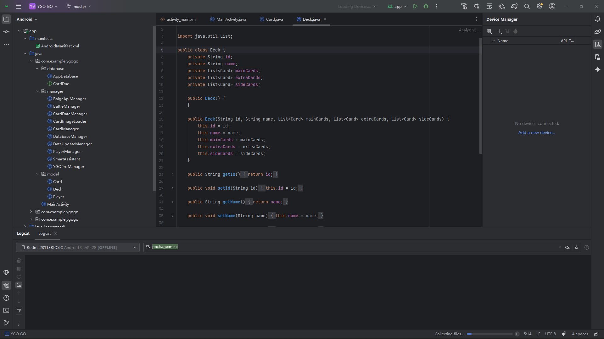
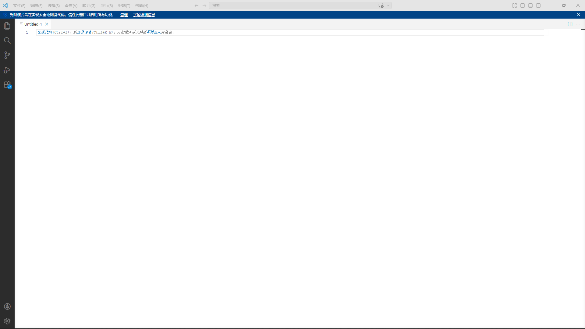
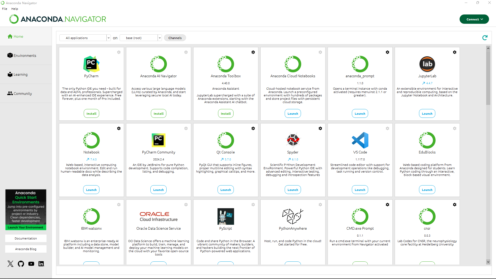

# 实验一：开发环境搭建

## 实验内容

- 安装 Android Studio 4.1 以上版本，更好地支持 LiteRT
- 安装 Jupyter Notebook 和相关的 Python 环境，用于机器学习模型构建
- 安装 Visual Studio Code 代码编辑器
- 探索上述软件的使用，将安装过程以 Markdown 语法描述

---

## 一、安装 Android Studio

### 1.1 版本要求

安装 **Android Studio 4.1 以上**版本，更好地支持 LiteRT。当前最新版本为 **Android Studio Panda 3**。

### 1.2 下载与安装

- 从 [Android Studio 官方网站](https://developer.android.com/studio) 下载最新版本
- 运行安装程序，按默认选项完成安装

### 1.3 配置阿里云 Maven 镜像

Android 应用的编译依赖 Gradle 工具，需要下载大量的 Gradle 封装器、工具包以及项目依赖库。为加速下载，建议使用阿里云云效 Maven 镜像。

在项目根目录的 `build.gradle` 文件中添加阿里云镜像仓库：

```groovy
repositories {
    maven { url 'https://maven.aliyun.com/repository/google' }
    maven { url 'https://maven.aliyun.com/repository/public' }
    maven { url 'https://maven.aliyun.com/repository/gradle-plugin' }
    google()
    mavenCentral()
}
```

### 1.4 新建并编译运行 Android 应用

Android Studio 安装完成后，新建一个 Android 应用并编译运行。第一次编译运行时会自动下载 Gradle 相关的依赖库，请耐心等待。

---

## 二、安装 Jupyter Notebook（通过 Anaconda）

### 2.1 关于 Anaconda

**Anaconda** 提供了在单台机器上执行 Python/R 数据科学和机器学习的最简单方式。Anaconda 包含了 conda、Python 在内的数以千计的科学包及其依赖项。

- **conda** 是一个包和环境管理工具，主要用于 Python、机器学习的开发中，可以进行独立 Python 环境的创建与隔离，并且可以在不同环境中切换，在各自环境中安装各自所需的包。

### 2.2 下载与安装 Anaconda

1. 从 [Anaconda 官方网站](https://www.anaconda.com/download) 下载安装包
2. 运行安装程序，注意以下事项：
   - **安装路径不能包含中文、空格等**
   - 选择 **Just Me**，否则需要管理员权限
   - 勾选 **Register Anaconda3 as my default Python**，使 Anaconda 成为系统默认 Python 环境
   - 不建议勾选 "Add Anaconda3 to my PATH environment variable"（可能导致与其他软件冲突）

### 2.3 验证 Anaconda 是否安装成功

安装完成后，通过以下方式验证：

1. **启动 Anaconda Navigator**：开始菜单 → Anaconda3（64-bit）→ Anaconda Navigator，若启动成功则说明安装成功
2. **使用 Anaconda Prompt**：开始菜单 → Anaconda3（64-bit）→ 右键 Anaconda Prompt → 以管理员身份运行，在终端中输入以下命令查看已安装的包：

```bash
conda list
```

若能正常显示已安装的包名和版本号，则说明安装成功。

### 2.4 使用 Anaconda Navigator 启动 Jupyter Notebook

1. 启动 **Anaconda Navigator** 导航界面
2. 从导航界面点击 **Jupyter Notebook** 的 Launch 按钮启动
3. Notebook 启动后默认列出用户文件夹的项目
4. 新建一个 **Notebook（Python 3）**，即可开始编写代码和文本

### 2.5 Jupyter Notebook 简介

Jupyter Notebook 是一种交互式计算与开发环境，将代码、运行结果、公式、图表和文字说明集成在同一个文档中。

**核心特点：**
- **交互式编程**：代码可按单元逐段运行，便于调试与验证
- **多内容融合**：支持 Markdown、LaTeX 公式、图片、表格与可视化结果
- **数据分析友好**：常与 Python、NumPy、Pandas、Matplotlib 等工具配合使用
- **便于教学与展示**：适合演示算法过程、实验步骤和分析结论
- **可复现性强**：完整保留代码、参数、输出结果与说明文档

**典型应用场景：**数据分析、机器学习实验、教学演示、科研计算、原型验证

---

## 三、安装 Visual Studio Code

### 3.1 下载与安装

**Visual Studio Code（VS Code）** 是一款优秀的跨平台协同代码编辑器，采用插件式开发，支持众多编程语言和环境。

1. 从 [Visual Studio Code 官方网站](https://code.visualstudio.com/) 下载安装包
2. 运行安装程序，按默认选项完成安装

### 3.2 安装推荐插件

安装完成后，在 VS Code 的扩展市场中搜索并安装以下插件：

- **Python**：Python 语言支持
- **Jupyter**：在 VS Code 中使用 Jupyter Notebook
- **Jupyter Keymap**：Jupyter 快捷键映射

### 3.3 在 VS Code 中创建 Notebook

安装 Jupyter 插件后，在 VS Code 中通过快捷键 `Ctrl+Shift+P` 打开命令面板，输入 "Create: New Jupyter Notebook" 即可创建一个新的 Notebook。

---

## 四、安装成功界面展示

以下为安装过程中的关键界面截图：

### Anaconda 安装及启动界面







---

## 参考资料

- [Android Studio 官方文档](https://developer.android.com/studio)
- [Anaconda 介绍、安装及使用教程](https://docs.anaconda.com/)
- [Visual Studio Code 官方文档](https://code.visualstudio.com/docs)
- [Jupyter Notebook 官方文档](https://jupyter-notebook.readthedocs.io/)
- [阿里云云效 Maven 镜像](https://developer.aliyun.com/mvn/guide)
