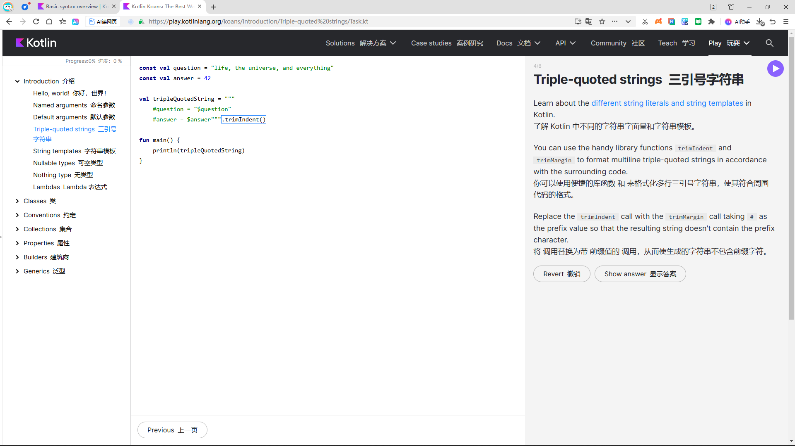
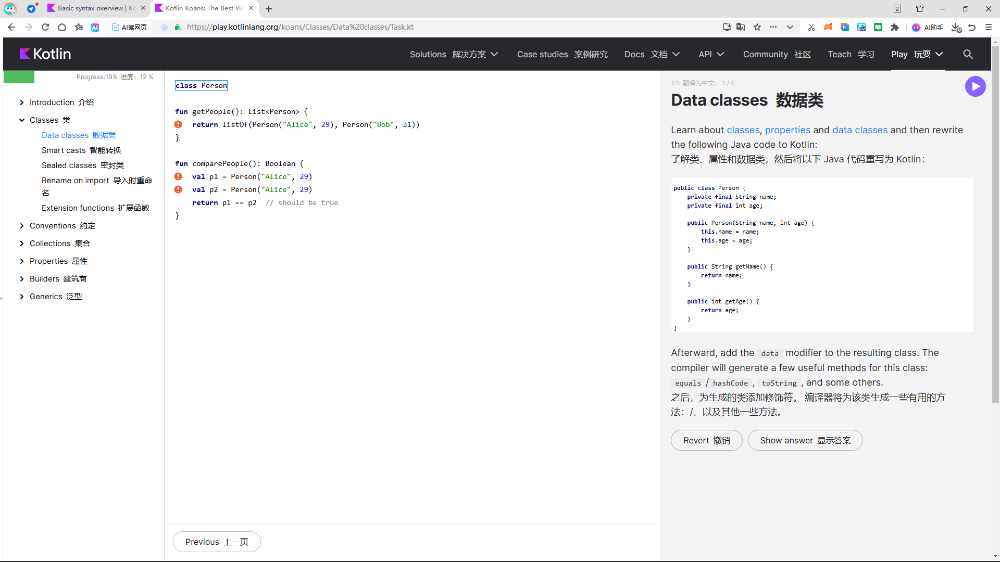
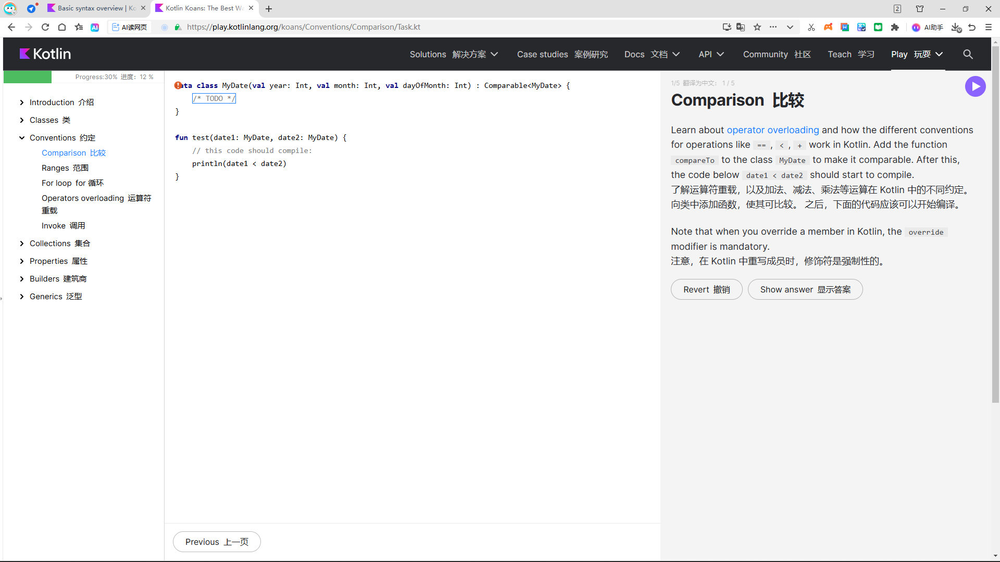
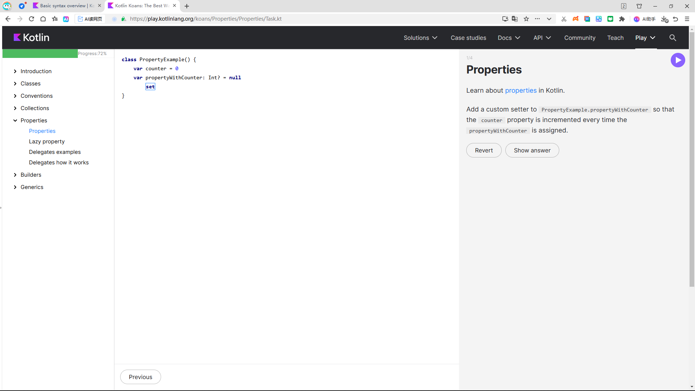
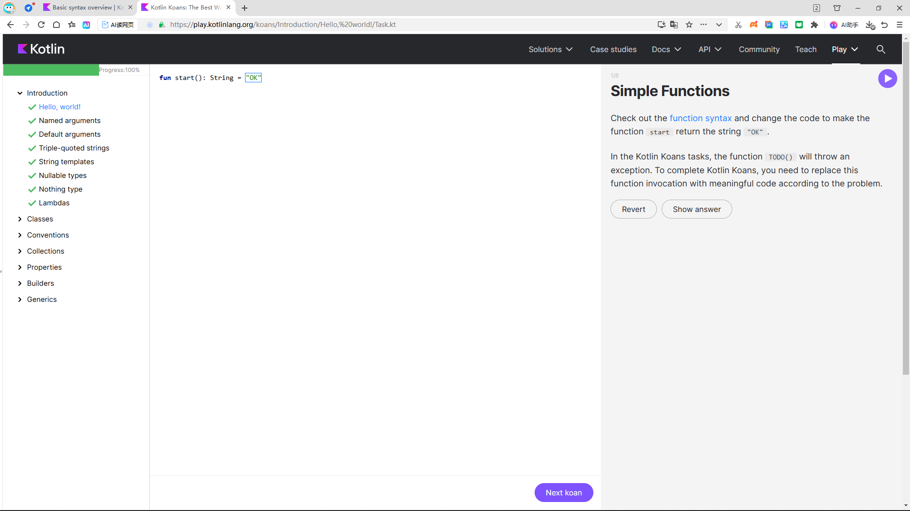

# exp2_1：Kotlin 基本语法学习

## 授课目标

建立"语法 → Kotlin 风格 → Android 场景"的完整认知。

## 本节重点

- 变量与类型、空安全、控制流、函数与 Lambda
- 集合、类与 data class、Android 写法示例

## 学习建议

在 Android Studio 或 [Kotlin Playground](https://play.kotlinlang.org/) 中立即练习。

---

## 一、Kotlin 语言简介

### 为什么 Android 课程优先讲 Kotlin？

- Google 将 Kotlin 作为 Android 开发的推荐语言
- 语法更简洁、空安全能力更强
- 与 Java 生态可以平滑协作

### 语言特点

| 特点 | 说明 |
|------|------|
| 静态类型 | 类型在编译期确定，出错更早暴露 |
| 跨平台 | 可运行于 JVM、Android、后端、Multiplatform 等场景 |
| 与 Java 互操作 | 可直接复用大量已有库与框架 |
| 表达力更强 | 支持表达式函数、Lambda、高阶函数、扩展函数等 |

### 最小示例

```kotlin
fun main() {
    val language = "Kotlin"
    println("Hello, $language")
}
```

---

## 二、变量声明：val / var 与类型推断

| 关键字 | 含义 |
|--------|------|
| `val` | 只读引用。不能重新赋值，但若引用的是可变对象，对象内部状态仍可能变化 |
| `var` | 可变引用。适合确实会变化的状态，但在业务代码中应尽量减少不必要的可变性 |
| 类型推断 | 多数场景下 Kotlin 能自动推断变量类型；在公共 API 与复杂表达式中，显式类型仍有价值 |

```kotlin
val appName = "AI Camera"
var count: Int = 10
count += 1

val userName: String = "Ada"
// userName = "Bob" // 编译错误
```

> **优先使用 `val`**：让状态更稳定、更容易推理。类型写在变量名后面：`name: String`。分号通常可以省略。静态类型 ≠ 必须处处手写类型。

---

## 三、常用类型、字符串模板与表达式风格

常见基础类型：`Int`、`Long`、`Double`、`Float`、`Boolean`、`Char`、`String`。

### 字符串模板

```kotlin
val score = 95
val user = "Tom"
val message = "用户 $user 的得分是 $score"
val level = if (score >= 90) "A" else "B"
println("$message，等级：$level")
```

### 表达式插值

```kotlin
val width = 1080
val height = 1920
println("ratio = ${width.toDouble() / height}")
```

- 字符串模板是 Kotlin 的高频语法：`$name` 与 `${expression}`
- 很多结构都可写成表达式，代码更紧凑，更适合 UI / 业务逻辑

---

## 四、Null 安全基础：Kotlin 的核心优势之一

### 基本概念

| 类型 | 说明 |
|------|------|
| 非空类型 | 默认情况下，Kotlin 变量不能保存 null（如 `String`） |
| 可空类型 | 在类型后加 `?` 表示该变量可能为空（如 `String?`） |

```kotlin
val title: String = "Kotlin"
// val bad: String = null // 编译错误

var subtitle: String? = null
subtitle = "Android AI"
```

> 与 Java 交互时，仍要警惕平台类型带来的不确定性。可空变量在使用前通常需要判空。

---

## 五、Null 安全进阶：安全调用、Elvis 与 let

### 安全调用 `?.`

```kotlin
val name: String? = getUserName()
val length = name?.length
```

如果对象不为 null，则继续访问成员；否则结果直接为 null。

### Elvis 运算符 `?:`

```kotlin
val displayName = name ?: "Guest"
```

如果左侧为 null，则返回右侧默认值。

### let 用法

```kotlin
name?.let { value ->
    println("用户名长度：${value.length}")
}
```

常用于"只在对象非空时执行一段逻辑"。

> `!!` 可强制断言非空，但会失去 Kotlin 空安全的优势。Android 开发中常见于读取 Intent 参数、网络返回数据、ViewBinding 等场景。

---

## 六、条件表达式：if 与 when

### if 作为表达式

Kotlin 中 if 不只是语句，也可以作为表达式直接返回值（Kotlin 没有传统三元运算符）：

```kotlin
val level = if (score >= 90) {
    "优秀"
} else {
    "继续努力"
}
```

### when 表达式

比多层 if-else 更清晰的分支结构：

```kotlin
val result = when (networkState) {
    "wifi" -> "高速网络"
    "mobile" -> "移动数据"
    else -> "未知状态"
}
```

> when 可搭配区间、类型判断、多个分支条件。

---

## 七、循环与区间：for、while、ranges

### for 与区间

```kotlin
for (i in 1..5) {
    println(i)
}

for (i in 0 until 3) {
    println("index = $i")
}
```

### 遍历集合

```kotlin
val items = listOf("cat", "dog", "bird")
for ((index, item) in items.withIndex()) {
    println("$index -> $item")
}
```

| 常用区间 | 含义 |
|----------|------|
| `1..5` | 闭区间 |
| `0 until 3` | 左闭右开 |
| `5 downTo 1 step 2` | 倒序步进 |
| `while` | 循环次数不确定时使用 |

> 多数业务代码优先遍历集合，而不是手写下标循环。

---

## 八、函数基础：参数、返回值、默认参数

### 定义函数

```kotlin
fun greet(name: String): String {
    return "Hello, $name"
}

fun double(x: Int) = x * 2
```

- `fun` 是函数声明关键字
- 参数格式：`name: Type`
- 返回类型写在参数列表后；若从表达式可明确推断，可写成表达式函数

### 默认参数

```kotlin
fun predict(
    imagePath: String,
    threshold: Float = 0.5f,
    verbose: Boolean = false
) { /* ... */ }
```

> 默认参数让函数调用更灵活，减少重载数量。

---

## 九、Lambda 与高阶函数

### Lambda 表达式

```kotlin
val stringLength: (String) -> Int = { input ->
    input.length
}
```

Lambda 本质上是可以像数据一样传递的函数。

### 高阶函数

```kotlin
fun stringMapper(str: String, mapper: (String) -> Int): Int {
    return mapper(str)
}

val result = stringMapper("Android") { it.length }
```

高阶函数：参数或返回值中包含函数。

> Android 中常见场景：点击事件、列表处理、异步回调、Compose 中的事件传递。

---

## 十、集合：List、Set、Map 与常见操作

| 类型 | 特点 |
|------|------|
| `List` | 有序集合，允许重复元素，最常用 |
| `Set` | 无重复元素，适合去重 |
| `Map` | 键值对结构，适合做映射关系 |

```kotlin
val scores = listOf(80, 90, 100)
val passed = scores.filter { it >= 90 }
val labels = passed.map { "score=$it" }

val modelInfo = mapOf(
    "name" to "LiteRT",
    "platform" to "Android"
)
println(modelInfo["name"])
```

> 优先使用只读集合：`listOf` / `mapOf`。配合 `filter`、`map`、`forEach` 等函数式操作，可写出更清晰的数据处理代码。

---

## 十一、类、主构造函数与属性

```kotlin
class Car(val brand: String, var speed: Int) {
    fun accelerate() {
        speed += 10
    }
}

val car = Car("BYD", 0)
car.accelerate()
println(car.speed)
```

- `class` 用于定义类
- 主构造函数可直接写在类名后面
- `val` / `var` 放在构造参数前，可直接声明为属性
- 属性与函数共同描述对象的"状态"和"行为"

> Android 联系：Activity、ViewModel、数据模型类，本质上都在使用类与对象。

---

## 十二、data class、object 与 Kotlin 常见建模方式

### data class

```kotlin
data class User(
    val id: Int,
    val name: String,
    val vip: Boolean
)
```

- 适合表示纯数据模型：网络返回、数据库实体、UI 状态
- Kotlin 自动生成 `toString`、`equals`、`hashCode`、`copy` 等方法

### object 单例

```kotlin
object Config {
    const val APP_NAME = "AI Demo"
}
```

常用于单例对象、工具配置、全局常量容器。

---

## 十三、面向 Android 的 Kotlin 写法示例

### 不可变状态（Compose 常见模式）

```kotlin
data class UiState(
    val title: String = "Kotlin Demo",
    val count: Int = 0
)

fun onAddClick(state: UiState): UiState {
    return state.copy(count = state.count + 1)
}
```

状态更新通常不是"直接改很多字段"，而是返回一个新的状态对象。这种风格能降低副作用，便于调试与测试。

### 列表处理

```kotlin
val users = listOf("Ada", "Bob", "Cindy")
users.forEach { name ->
    println("Hello, $name")
}
```

---

## 十四、初学者常见易错点与编码建议

1. 把 `val` 理解成"绝对不可变"——实际上它只保证引用不可重新指向别处
2. 滥用 `!!`——一旦断言失败，仍然会触发空指针问题
3. 看到集合就只会写 `for` 循环，忽略 `map` / `filter` 等更清晰的表达
4. 函数参数太多、类型不明确，导致调用点难读
5. 只会抄语法，不会放进 Android 业务场景中思考

---

## 十五、实验内容

完成 [Kotlin Koans](https://play.kotlinlang.org/koans/overview) 上的内容，要求完成比例 >= 85%。

---

## 十六、参考资源

- [Kotlin 官方语法总览](https://kotlinlang.org/docs/basic-syntax.html)
- [Kotlin Null Safety](https://kotlinlang.org/docs/null-safety.html)
- [Kotlin 条件与循环](https://kotlinlang.org/docs/control-flow.html)
- [Android 官方 Kotlin 学习入口](https://developer.android.com/kotlin/learn)
- [Kotlin 官方在线调试](https://play.kotlinlang.org/)
- [Kotlin Koans 练习](https://play.kotlinlang.org/koans/overview)

---

## 十七、学习过程截图展示

以下为 Kotlin Koans 学习过程中的界面截图：









