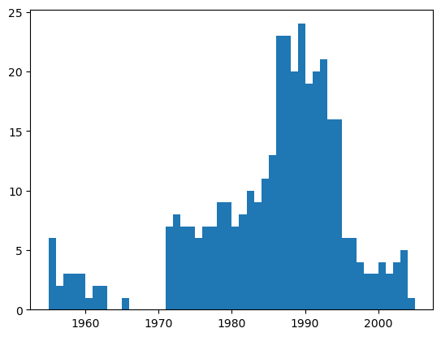
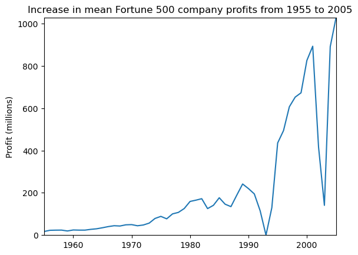
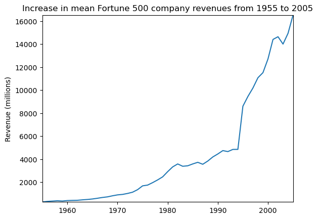
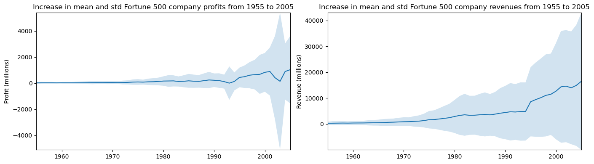

# 实验三：Fortune 500 数据分析

## 项目简介

本项目基于 **Jupyter Notebook** 对 Fortune 500（财富 500 强）公司数据进行了探索性数据分析，时间跨度从 1955 年到 2005 年。

> 📓 **Notebook 说明**: 本项目所有分析代码均在 Jupyter Notebook 中交互式执行，代码和输出结果已导出为 [`Untitled.md`](Untitled.md) 文件。

## 数据集

- **数据来源**: fortune500.csv
- **时间范围**: 1955-2005 年
- **数据量**: 25,500 条记录（清洗后为 25,131 条）
- **字段说明**:
  - `Year`: 年份
  - `Rank`: 排名
  - `Company`: 公司名称
  - `Revenue (in millions)`: 营收（百万美元）
  - `Profit (in millions)`: 利润（百万美元）

## 主要分析内容

### 1. 数据加载与预览

```python
# 导入必要的库
import numpy as np
import pandas as pd
import matplotlib.pyplot as plt
import seaborn as sns

# 读取 CSV 文件
df = pd.read_csv('fortune500.csv')

# 查看前 5 行数据
df.head()

# 查看后 5 行数据
df.tail()
```

**说明**:

- 使用 `pd.read_csv()` 读取 CSV 文件到 DataFrame
- `head()` 和 `tail()` 用于快速查看数据结构和内容
- 初始数据包含 25,500 条记录

### 2. 数据清洗

```python
# 重命名列名为更简洁的形式
df.columns = ['year', 'rank', 'company', 'revenue', 'profit']

# 检查数据类型
df.dtypes

# 识别 profit 列中的非数值数据（包含非数字字符）
non_numberic_profits = df.profit.str.contains('[^0-9.-]')

# 查看包含非数值利润的数据
df.loc[non_numberic_profits].head()

# 统计非数值利润的数量
len(df.profit[non_numberic_profits])  # 369 条

# 可视化非数值数据的年份分布
bin_sizes, _, _ = plt.hist(df.year[non_numberic_profits], bins=range(1955, 2006))

# 过滤掉非数值数据，并将 profit 列转换为数值类型
df = df.loc[~non_numberic_profits]
df.profit = df.profit.apply(pd.to_numeric)
```

**说明**:

- 发现 369 条记录的利润值为 "N.A."（不可用）
- 使用正则表达式 `[^0-9.-]` 匹配包含非数字字符的数据
- 通过直方图发现早期数据（1955 年左右）缺失较多
- 清洗后剩余 25,131 条有效数据

### 3. 统计分析

```python
# 按年份分组，计算每年的平均利润和营收
group_by_year = df.loc[:, ['year', 'revenue', 'profit']].groupby('year')
avgs = group_by_year.mean()

# 提取年份和平均值
x = avgs.index
y1 = avgs.profit
y2 = avgs.revenue

# 计算标准差（用于后续可视化）
stds1 = group_by_year.std().profit.values
stds2 = group_by_year.std().revenue.values
```

**说明**:

- 使用 `groupby('year')` 按年份分组
- `mean()` 计算每组的平均值
- `std()` 计算每组的标准差，反映数据离散程度

### 4. 数据可视化

#### 4.1 定义绘图函数

```python
def plot(x, y, ax, title, y_label):
    """基础绘图函数"""
    ax.set_title(title)
    ax.set_ylabel(y_label)
    ax.plot(x, y)
    ax.margins(x=0, y=0)  # 去除坐标轴空白
```

#### 4.2 绘制平均利润趋势图

```python
fig, ax = plt.subplots()
plot(x, y1, ax, 
     'Increase in mean Fortune 500 company profits from 1955 to 2005', 
     'Profit (millions)')
```

#### 4.3 绘制平均营收趋势图

```python
fig, ax = plt.subplots()
plot(x, y2, ax, 
     'Increase in mean Fortune 500 company revenues from 1955 to 2005', 
     'Revenue (millions)')
```

#### 4.4 绘制带标准差的趋势图

```python
def plot_with_std(x, y, stds, ax, title, y_label):
    """绘制带标准差阴影的图表"""
    # fill_between 在 y-std 和 y+std 之间填充半透明区域
    ax.fill_between(x, y - stds, y + stds, alpha=0.2)
    plot(x, y, ax, title, y_label)

# 创建包含两个子图的画布
fig, (ax1, ax2) = plt.subplots(ncols=2)

# 绘制利润和营收的趋势图（含标准差）
plot_with_std(x, y1.values, stds1, ax1, 
              title % 'profits', 'Profit (millions)')
plot_with_std(x, y2.values, stds2, ax2, 
              title % 'revenues', 'Revenue (millions)')

# 设置画布大小和布局
fig.set_size_inches(14, 4)
fig.tight_layout()  # 自动调整子图间距
```

**说明**:

- `fill_between()` 在平均值±标准差之间填充半透明区域
- 标准差越大，表示该年份公司间的利润/营收差异越大
- 使用 `subplots(ncols=2)` 创建并排的两个子图
- `tight_layout()` 自动优化子图布局，避免重叠

## 可视化结果

### 非数值利润数据年份分布



*图 1: 1955-2005 年间非数值利润数据的分布情况*

### 平均利润趋势



*图 2: 1955-2005 年财富 500 强公司平均利润变化*

### 平均营收趋势



*图 3: 1955-2005 年财富 500 强公司平均营收变化*

### 利润与营收趋势（含标准差）



*图 4: 1955-2005 年财富 500 强公司利润和营收的平均值及标准差*

## 使用的库

- `numpy`: 数值计算
- `pandas`: 数据处理和分析
- `matplotlib`: 数据可视化
- `seaborn`: 统计图形绘制

## 文件结构

```
实验三/
├── README.md              # 项目说明文档
├── Untitled.md            # Jupyter Notebook 导出的分析代码
├── images/                # 可视化输出图片
│   ├── output_11_0.png    # 非数值利润数据年份分布
│   ├── output_16_0.png    # 平均利润趋势图
│   ├── output_17_0.png    # 平均营收趋势图
│   └── output_18_0.png    # 带标准差的趋势图
└── fortune500.csv         # 原始数据文件（需自备）
```

## 运行环境

- Python 3.x
- 需要安装以下依赖:
  ```
  numpy
  pandas
  matplotlib
  seaborn
  ```

## 主要发现

通过分析 1955-2005 年财富 500 强数据，可以观察到:

- 50 年间大公司的平均利润和营收呈现增长趋势
- 部分早期数据存在缺失值（标记为 N.A.）
- 数据波动性（标准差）随时间变化

