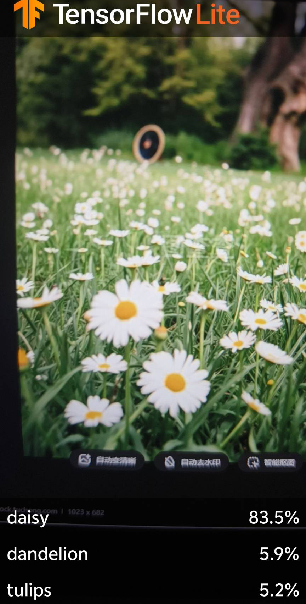
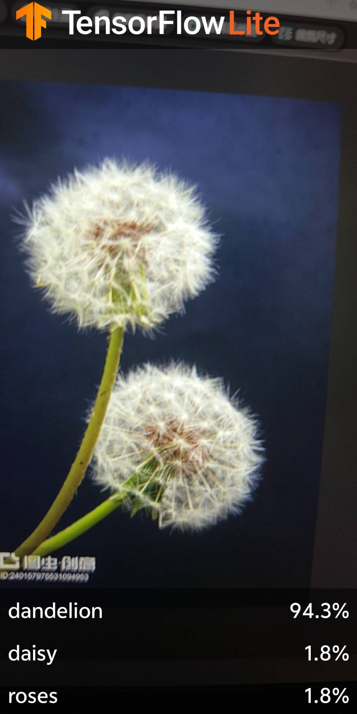
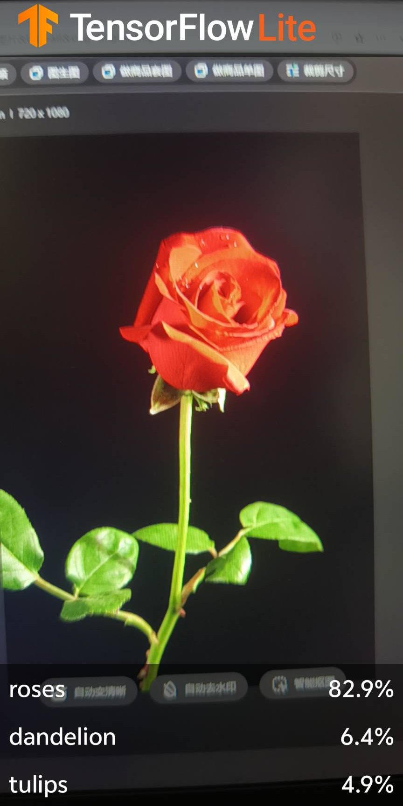
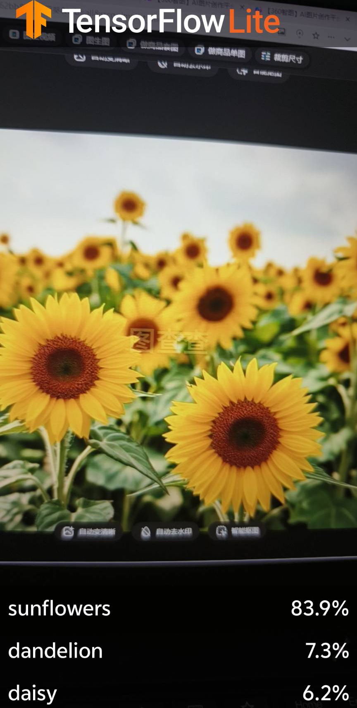
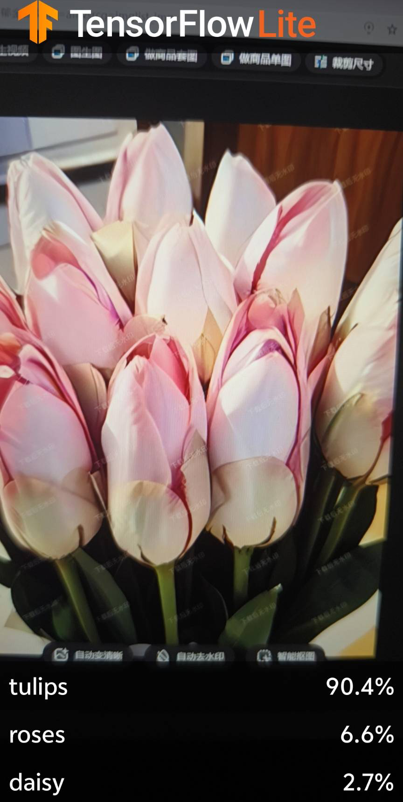

# TFL Classify —— 基于 TensorFlow Lite 的花卉识别 Android 应用

## 项目简介

本项目是一个基于 **TensorFlow Lite** 的花卉识别 Android 应用，使用 **CameraX** 实时捕获摄像头画面，通过已训练好的 `FlowerModel.tflite` 模型对花卉进行实时分类识别。应用能够识别多种花卉，包括 **雏菊（Daisy）、蒲公英（Dandelion）、玫瑰（Rose）、向日葵（Sunflowers）、郁金香（Tulips）** 等。

该项目来源于 TensorFlow 官方 Codelab [Recognize Flowers with TensorFlow on Android](https://goo.gle/3dbCSbt)，使用 Kotlin 语言开发，采用 Android Studio 构建。

## 项目结构

```
TFLClassify-main/
├── build.gradle                  # 顶层构建配置
├── settings.gradle               # 项目模块配置
├── gradle.properties             # Gradle 属性配置
├── start/                        # 起始代码（入门模板）
│   ├── build.gradle
│   └── src/main/
│       ├── AndroidManifest.xml
│       ├── java/.../classification/
│       │   └── MainActivity.kt   # 主 Activity
│       ├── ml/
│       │   └── FlowerModel.tflite # 训练好的 TFLite 花卉模型
│       └── res/                   # 资源文件
└── finish/                       # 完整代码（含 GPU 加速）
    ├── build.gradle
    └── src/main/
        ├── AndroidManifest.xml
        ├── java/.../classification/
        │   └── MainActivity.kt   # 完整版 MainActivity（含 GPU 委托）
        ├── ml/
        │   └── FlowerModel.tflite
        └── res/                   # 资源文件
```

- **start** 模块：起始模板代码，包含相机预览和模型加载的基础框架。
- **finish** 模块：完整实现，在 `start` 基础上添加了 GPU 加速支持。

## 技术栈

| 技术                               | 说明                            |
| -------------------------------- | ----------------------------- |
| **Kotlin**                       | 主要开发语言                        |
| **Android Studio**               | IDE 和构建工具                     |
| **TensorFlow Lite**              | 轻量级机器学习推理框架                   |
| **TensorFlow Lite GPU Delegate** | 利用手机 GPU 加速模型推理               |
| **CameraX**                      | Android Jetpack 相机 API，简化相机开发 |
| **Android ML Model Binding**     | Android Studio 自动生成的模型绑定代码    |
| **Jetpack ViewModel & LiveData** | 数据管理和 UI 更新                   |
| **RecyclerView**                 | 显示识别结果列表                      |

## 核心功能

1. **实时相机预览** —— 使用 CameraX 捕获摄像头实时画面
2. **花卉识别推理** —— 将相机帧送入 `FlowerModel.tflite` 模型进行实时分类
3. **Top-3 结果展示** —— 在屏幕底部显示置信度最高的 3 个识别结果
4. **GPU 加速（finish 模块）** —— 检测设备是否支持 GPU 委托，自动切换 GPU/CPU 推理

## 运行检测效果展示

以下是使用本应用对各类花卉进行实时识别的运行截图：

### 雏菊（Daisy）



### 蒲公英（Dandelion）



### 玫瑰（Rose）



### 向日葵（Sunflowers）



### 郁金香（Tulips）



从上述运行效果可以看出，应用能够准确地识别出摄像头前不同种类的花卉，并在屏幕底部实时展示识别标签和置信度分数，识别效果良好。

## 环境要求

- **Android Studio** Hedgehog 及以上版本
- **Gradle** 8.x（通过 wrapper 自动下载）
- **编译 SDK** 34
- **最低 SDK** 21（Android 5.0）
- **目标 SDK** 34
- **Kotlin** 2.1.20
- **Android 设备** 需配备摄像头（用于实时检测）

## 构建与运行

### 1. 克隆或导入项目

使用 Android Studio 打开 `TFLClassify-main` 目录。

### 2. 同步 Gradle

Android Studio 会自动提示同步 Gradle，点击 **Sync Now** 等待依赖下载完成。

### 3. 选择运行模块

在 Android Studio 顶部工具栏的运行配置中，选择 **start** 或 **finish** 模块。

### 4. 连接设备并运行

- 使用 USB 连接一台配备摄像头的 Android 设备
- 确保设备已开启 **USB 调试**
- 点击 **Run** 按钮，等待编译安装

### 5. 授权相机权限

首次运行时，应用会请求相机权限，点击**允许**即可开始使用。

## 关键代码说明

### 整体数据流架构

整个应用遵循 **MVVM（Model-View-ViewModel）** 架构，数据从摄像头流向 UI 的全流程如下：

```
摄像头帧 (CameraX ImageProxy)
    ↓ YUV → RGB 转换 (YuvToRgbConverter)
Bitmap
    ↓ 封装为 TensorImage
模型推理 (FlowerModel.process)
    ↓ 输出概率列表
排序取 Top-3 (probabilityAsCategoryList → sortByDescending → take)
    ↓ 包装为 Recognition 列表
回调通知 (RecognitionListener)
    ↓ 更新 ViewModel
RecognitionListViewModel.updateData()
    ↓ LiveData 通知 Observer
RecognitionAdapter.submitList() (DiffUtil 对比差异)
    ↓ 更新 RecyclerView
屏幕底部实时显示 Top-3 识别结果
```

---

### 1. 依赖配置（build.gradle）

项目通过 Gradle 引入 TensorFlow Lite 和 CameraX 等核心依赖：

```groovy
// ========== TensorFlow Lite 相关 ==========
// TFLite Support Library —— 提供 TensorImage、概率列表等高级 API
implementation 'org.tensorflow:tensorflow-lite-support:0.4.4'
// TFLite Metadata —— 配合 ML Model Binding 读取模型元数据（标签名等）
implementation 'org.tensorflow:tensorflow-lite-metadata:0.4.4'
// TFLite GPU Delegate（仅 finish 模块）—— 利用手机 GPU 加速推理
implementation 'org.tensorflow:tensorflow-lite-gpu:2.14.0'

// ========== CameraX 相机框架 ==========
// 底层 camera2 实现
implementation "androidx.camera:camera-camera2:$camerax_version"
// 生命周期感知，自动管理相机启停
implementation "androidx.camera:camera-lifecycle:$camerax_version"
// PreviewView 控件 —— 用于在界面上显示预览画面
implementation "androidx.camera:camera-view:1.0.0-alpha17"

// ========== ML Model Binding ==========
// 启用后 Android Studio 会根据 .tflite 文件自动生成 FlowerModel 绑定类
buildFeatures {
    mlModelBinding true
    dataBinding = true    // 用于 RecyclerView item 的数据绑定
}
```

---

### 2. 权限申请流程（MainActivity.kt）

应用启动时首先检查相机权限，这是 Android 动态权限模型的标准实现：

```kotlin
// 定义需要的权限数组
private val REQUIRED_PERMISSIONS = arrayOf(Manifest.permission.CAMERA)
private const val REQUEST_CODE_PERMISSIONS = 999

override fun onCreate(savedInstanceState: Bundle?) {
    super.onCreate(savedInstanceState)
    setContentView(R.layout.activity_main)

    // Step 1: 检查权限是否已授予
    if (allPermissionsGranted()) {
        startCamera()   // 已有权限，直接启动相机
    } else {
        // Step 2: 未授权则弹出系统权限请求对话框
        ActivityCompat.requestPermissions(
            this, REQUIRED_PERMISSIONS, REQUEST_CODE_PERMISSIONS
        )
    }
}

// 检查所有必要权限是否都已授予
private fun allPermissionsGranted(): Boolean = REQUIRED_PERMISSIONS.all {
    ContextCompat.checkSelfPermission(baseContext, it) == PackageManager.PERMISSION_GRANTED
}

// Step 3: 用户做出选择后的回调
override fun onRequestPermissionsResult(
    requestCode: Int, permissions: Array<String>, grantResults: IntArray
) {
    if (requestCode == REQUEST_CODE_PERMISSIONS) {
        if (allPermissionsGranted()) {
            startCamera()          // 用户同意，启动相机
        } else {
            // 用户拒绝，提示后退出（生产环境应提供重新申请的入口）
            Toast.makeText(this, getString(R.string.permission_deny_text), Toast.LENGTH_SHORT).show()
            finish()
        }
    }
}
```

---

### 3. CameraX 相机初始化（startCamera 方法）

CameraX 是本项目最核心的框架之一，它将相机操作抽象为多个 **Use Case**，本项目使用了两个：

- **Preview**：负责将实时画面渲染到屏幕上的 `PreviewView`
- **ImageAnalysis**：负责将每一帧交给 ML 模型进行分析

```kotlin
private fun startCamera() {
    // Step 1: 获取 CameraProvider 实例（Future 模式，异步获取）
    val cameraProviderFuture = ProcessCameraProvider.getInstance(this)

    cameraProviderFuture.addListener({
        val cameraProvider: ProcessCameraProvider = cameraProviderFuture.get()

        // ====== Preview Use Case（预览） ======
        preview = Preview.Builder().build()

        // ====== ImageAnalysis Use Case（分析） ======
        imageAnalyzer = ImageAnalysis.Builder()
            // 设置理想的分析分辨率，CameraX 会选择最接近的可用分辨率
            .setTargetResolution(Size(224, 224))
            // 背压策略：STRATEGY_KEEP_ONLY_LATEST
            // 当分析速度跟不上帧率时，丢弃旧帧，只处理最新帧
            .setBackpressureStrategy(ImageAnalysis.STRATEGY_KEEP_ONLY_LATEST)
            .build()
            .also { analysisUseCase ->
                // 绑定自定义的 ImageAnalyzer，在单线程执行器中运行
                analysisUseCase.setAnalyzer(cameraExecutor, ImageAnalyzer(this) { items ->
                    // ML 推理完成后的回调 —— 更新 ViewModel
                    recogViewModel.updateData(items)
                })
            }

        // Step 2: 选择后置摄像头，不可用时退回到前置
        val cameraSelector =
            if (cameraProvider.hasCamera(CameraSelector.DEFAULT_BACK_CAMERA))
                CameraSelector.DEFAULT_BACK_CAMERA
            else CameraSelector.DEFAULT_FRONT_CAMERA

        try {
            cameraProvider.unbindAll()
            // Step 3: 将 Preview 和 ImageAnalysis 绑定到当前 Activity 的生命周期
            //         CameraX 会自动在 onPause/onResume 时管理相机资源
            camera = cameraProvider.bindToLifecycle(
                this, cameraSelector, preview, imageAnalyzer
            )
            // Step 4: 将预览画面连接到 PreviewView 控件
            preview.setSurfaceProvider(viewFinder.surfaceProvider)
        } catch (exc: Exception) {
            Log.e(TAG, "Use case binding failed", exc)
        }
    }, ContextCompat.getMainExecutor(this))
}
```

> **关于 STRATEGY_KEEP_ONLY_LATEST**：这是实时 ML 推理的关键配置。如果分析速度慢于相机帧率（默认 30fps），CameraX 会丢弃积压的旧帧，只保留最新的一帧进行分析，确保推理结果始终反映当前画面，避免延迟累积。

---

### 4. 模型加载（ImageAnalyzer 内部类）

`FlowerModel` 是由 **Android Studio ML Model Binding** 功能根据 `FlowerModel.tflite` 文件自动生成的绑定类。`by lazy` 延迟初始化确保模型在第一次调用 `analyze()` 时才加载，避免阻塞 UI 线程。

**start 模块 —— CPU 推理：**

```kotlin
private val flowerModel: FlowerModel by lazy {
    FlowerModel.newInstance(ctx)   // 使用默认选项，CPU 推理
}
```

**finish 模块 —— 智能 GPU/CPU 切换：**

```kotlin
private val flowerModel: FlowerModel by lazy {
    // Step 1: 创建 GPU 兼容性检测器
    val compatList = CompatibilityList()
    
    // Step 2: 根据设备 GPU 支持情况选择推理设备
    val options = if (compatList.isDelegateSupportedOnThisDevice) {
        // 设备支持 GPU Delegate → 使用 GPU 加速推理
        Log.d(TAG, "This device is GPU Compatible")
        Model.Options.Builder().setDevice(Model.Device.GPU).build()
    } else {
        // 设备不支持 GPU → 回退到 CPU，开启 4 线程并行
        Log.d(TAG, "This device is GPU Incompatible")
        Model.Options.Builder().setNumThreads(4).build()
    }

    FlowerModel.newInstance(ctx, options)
}
```

> **GPU Delegate 原理**：TensorFlow Lite 的 GPU Delegate 利用移动端 GPU 的大规模并行计算能力，将神经网络中的矩阵运算（卷积、全连接等）映射到 GPU 的着色器程序上执行。对于图像分类这类计算密集型任务，GPU 加速通常可使推理速度提升 **2~5 倍**，同时降低 CPU 占用和功耗。

---

### 5. 图像分析与推理（analyze 方法）

这是整个应用最核心的方法，每收到一帧相机画面都会触发一次：

```kotlin
override fun analyze(imageProxy: ImageProxy) {
    val items = mutableListOf<Recognition>()

    // ===== 步骤 1：YUV → RGB → TensorImage =====
    // CameraX 输出的 ImageProxy 默认是 YUV_420_888 格式
    // 而 TFLite 模型需要的输入是 RGB 格式的 TensorImage
    val tfImage = TensorImage.fromBitmap(toBitmap(imageProxy))

    // ===== 步骤 2：模型推理 + 排序 + 取 Top-3 =====
    val outputs = flowerModel.process(tfImage)       // 执行推理，返回所有类别的概率
        .probabilityAsCategoryList                   // 转为 (label, score) 列表
        .apply {
            sortByDescending { it.score }            // 按置信度从高到低排序
        }
        .take(MAX_RESULT_DISPLAY)                    // 只取前 3 个最高置信度结果

    // ===== 步骤 3：包装为 Recognition 对象 =====
    for (output in outputs) {
        items.add(Recognition(output.label, output.score))
    }

    // ===== 步骤 4：回调通知结果 =====
    listener(items.toList())

    // ===== 步骤 5：关闭帧，触发下一帧的分析 =====
    imageProxy.close()
}
```

---

### 6. YUV → RGB 图像转换（toBitmap 方法）

CameraX 输出的图像格式是 **YUV_420_888**，而 TFLite 模型要求 **RGB** 输入。`YuvToRgbConverter` 负责这一转换，并通过 `Matrix` 处理设备旋转：

```kotlin
private val yuvToRgbConverter = YuvToRgbConverter(ctx)
private lateinit var bitmapBuffer: Bitmap     // 复用 Bitmap，避免每帧创建新对象
private lateinit var rotationMatrix: Matrix

@SuppressLint("UnsafeExperimentalUsageError")
private fun toBitmap(imageProxy: ImageProxy): Bitmap? {
    val image = imageProxy.image ?: return null   // 空帧检查

    // 首次调用时初始化 —— 后续帧复用相同的 buffer 和 matrix，提升性能
    if (!::bitmapBuffer.isInitialized) {
        rotationMatrix = Matrix()
        // 根据相机图像的旋转角度创建旋转变换矩阵
        rotationMatrix.postRotate(imageProxy.imageInfo.rotationDegrees.toFloat())
        // 分配一个 RGB Bitmap 缓冲区（ARGB_8888 格式，每像素 4 字节）
        bitmapBuffer = Bitmap.createBitmap(
            imageProxy.width, imageProxy.height, Bitmap.Config.ARGB_8888
        )
    }

    // 将 YUV 图像数据转换并写入 bitmapBuffer
    yuvToRgbConverter.yuvToRgb(image, bitmapBuffer)

    // 根据旋转矩阵创建方向正确的 Bitmap
    return Bitmap.createBitmap(
        bitmapBuffer, 0, 0,
        bitmapBuffer.width, bitmapBuffer.height,
        rotationMatrix, false
    )
}
```

> **性能优化要点**：`bitmapBuffer` 和 `rotationMatrix` 只在首次调用时创建，之后每帧复用。这避免了在高频回调中反复分配内存导致的 GC 压力（每帧约 33ms，即每秒 30 次）。

---

### 7. ViewModel + LiveData（MVVM 数据层）

ViewModel 负责在屏幕旋转等配置变更时保持数据不丢失，LiveData 负责通知 UI 层刷新：

```kotlin
// RecognitionListViewModel.kt
class RecognitionListViewModel : ViewModel() {
    // MutableLiveData（内部可写）→ LiveData（对外只读）
    private val _recognitionList = MutableLiveData<List<Recognition>>()
    val recognitionList: LiveData<List<Recognition>> = _recognitionList

    // ImageAnalyzer 每次推理完成后调用此方法更新数据
    fun updateData(recognitions: List<Recognition>) {
        _recognitionList.postValue(recognitions)  // postValue 可在后台线程安全调用
    }
}

// Recognition 数据类
data class Recognition(
    val label: String,        // 花卉名称，如 "Daisy"
    val confidence: Float     // 置信度，范围 0.0 ~ 1.0
) {
    // 格式化为百分比字符串，如 "87.3%"
    val probabilityString = String.format("%.1f%%", confidence * 100.0f)
}
```

**在 MainActivity 中绑定 LiveData：**

```kotlin
// 当 ViewModel 中的数据发生变化时，自动更新 RecyclerView
recogViewModel.recognitionList.observe(this, Observer {
    viewAdapter.submitList(it)  // ListAdapter 的 submitList 会触发 DiffUtil 对比
})
```

---

### 8. RecyclerView + DiffUtil（UI 展示层）

使用 `ListAdapter` + `DiffUtil` 实现高效的列表更新，只刷新有变化的 item：

```kotlin
// RecognitionAdapter.kt
class RecognitionAdapter(private val ctx: Context) :
    ListAdapter<Recognition, RecognitionViewHolder>(RecognitionDiffUtil()) {

    // 创建 ViewHolder，膨胀 recognition_item 布局并启用 DataBinding
    override fun onCreateViewHolder(parent: ViewGroup, viewType: Int): RecognitionViewHolder {
        val inflater = LayoutInflater.from(ctx)
        val binding = RecognitionItemBinding.inflate(inflater, parent, false)
        return RecognitionViewHolder(binding)
    }

    override fun onBindViewHolder(holder: RecognitionViewHolder, position: Int) {
        holder.bindTo(getItem(position))
    }

    // DiffUtil：精确判断哪些 item 需要更新
    private class RecognitionDiffUtil : DiffUtil.ItemCallback<Recognition>() {
        // 通过 label 判断是否为同一项
        override fun areItemsTheSame(oldItem: Recognition, newItem: Recognition): Boolean {
            return oldItem.label == newItem.label
        }
        // 通过 confidence 判断内容是否变化
        override fun areContentsTheSame(oldItem: Recognition, newItem: Recognition): Boolean {
            return oldItem.confidence == newItem.confidence
        }
    }
}

// ViewHolder：通过 DataBinding 直接将数据绑定到 UI 控件
class RecognitionViewHolder(private val binding: RecognitionItemBinding) :
    RecyclerView.ViewHolder(binding.root) {
    fun bindTo(recognition: Recognition) {
        binding.recognitionItem = recognition
        binding.executePendingBindings()
    }
}
```

> **为什么关闭 itemAnimator**：代码中设置了 `resultRecyclerView.itemAnimator = null`，目的是**减少闪烁**。在实时识别场景中，Top-3 结果的变化频率非常高。如果使用默认动画，列表项可能会频繁出现移动、淡入淡出效果，造成视觉上的剧烈抖动。

---

### 9. 关键常量与线程模型

```kotlin
// 只显示置信度最高的 3 个结果
private const val MAX_RESULT_DISPLAY = 3

// 日志标签，方便 Logcat 过滤
private const val TAG = "TFL Classify"

// 单线程执行器 —— ImageAnalyzer 的所有分析操作都在此线程上串行执行
// 避免了主线程阻塞，同时保证分析顺序
private val cameraExecutor = Executors.newSingleThreadExecutor()
```

## 学习要点

通过本项目可以学习到以下技术：

- 如何使用 **TensorFlow Lite Model Maker** 训练自定义图像分类模型
- 如何在 Android 应用中集成 **TensorFlow Lite** 模型
- 如何使用 **Android Studio ML Model Binding** 自动生成模型绑定代码
- 如何使用 **CameraX** 进行实时相机图像捕获和分析
- 如何利用 **GPU Delegate** 加速模型推理
- **MVVM 架构** 在 Android 中的实践（ViewModel + LiveData + RecyclerView）

<br />

<br />

