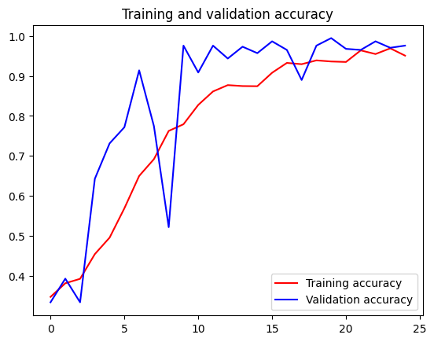

# exp5_2: 石头剪刀布图像分类（TensorFlow 卷积神经网络）

本实验使用 TensorFlow 对石头剪刀布（Rock-Paper-Scissors）数据集进行图像分类模型训练，通过卷积神经网络实现手势识别。

---

## 1. 下载数据集

从 Google 官方数据集下载石头剪刀布的训练集和测试集：

```python
#首先下载石头剪刀布的训练集和测试集：
import ssl
from pathlib import Path
from urllib.error import URLError
from urllib.request import urlopen

DOWNLOAD_DIR = Path("D:/mldownload")
DOWNLOAD_DIR.mkdir(parents=True, exist_ok=True)

RPS_URL = "https://storage.googleapis.com/learning-datasets/rps.zip"
RPS_TEST_URL = "https://storage.googleapis.com/learning-datasets/rps-test-set.zip"
RPS_ZIP = DOWNLOAD_DIR / "rps.zip"
RPS_TEST_ZIP = DOWNLOAD_DIR / "rps-test-set.zip"

def download_file(url, destination):
    if destination.exists() and destination.stat().st_size > 0:
        print(f"File already exists, skipping: {destination}")
        return

    temp_path = destination.with_suffix(destination.suffix + ".part")
    print(f"Downloading: {url}")

    try:
        response = urlopen(url, timeout=120)
    except URLError:
        context = ssl._create_unverified_context()
        response = urlopen(url, timeout=120, context=context)

    with response, temp_path.open("wb") as file:
        while True:
            data = response.read(1024 * 1024)
            if not data:
                break
            file.write(data)

    temp_path.replace(destination)
    size_mb = destination.stat().st_size / 1024 / 1024
    print(f"Downloaded: {destination} ({size_mb:.1f} MB)")

download_file(RPS_URL, RPS_ZIP)
download_file(RPS_TEST_URL, RPS_TEST_ZIP)
```

    File already exists, skipping: D:\mldownload\rps.zip
    File already exists, skipping: D:\mldownload\rps-test-set.zip

---

## 2. 解压数据集

```python
#然后解压下载的数据集
import zipfile

def extract_zip(zip_path, extract_dir):
    if not zip_path.exists():
        raise FileNotFoundError(f"Zip file not found. Run the download cell first: {zip_path}")

    with zipfile.ZipFile(zip_path, "r") as zip_ref:
        bad_file = zip_ref.testzip()
        if bad_file is not None:
            raise zipfile.BadZipFile(
                f"Zip file looks corrupted at {bad_file}. Delete {zip_path} and download again."
            )
        zip_ref.extractall(extract_dir)

    print(f"Extracted: {zip_path} -> {extract_dir}")

extract_zip(RPS_ZIP, DOWNLOAD_DIR)
extract_zip(RPS_TEST_ZIP, DOWNLOAD_DIR)
```

    Extracted: D:\mldownload\rps.zip -> D:\mldownload
    Extracted: D:\mldownload\rps-test-set.zip -> D:\mldownload

---

## 3. 数据探索

```python
#检测数据集的解压结果，打印相关信息
rock_dir = DOWNLOAD_DIR / "rps" / "rock"
paper_dir = DOWNLOAD_DIR / "rps" / "paper"
scissors_dir = DOWNLOAD_DIR / "rps" / "scissors"

for image_dir in [rock_dir, paper_dir, scissors_dir]:
    if not image_dir.exists():
        raise FileNotFoundError(
            f"Directory not found: {image_dir}. Run the download and extract cells first."
        )

rock_files = sorted(path.name for path in rock_dir.iterdir())
paper_files = sorted(path.name for path in paper_dir.iterdir())
scissors_files = sorted(path.name for path in scissors_dir.iterdir())

print("total training rock images:", len(rock_files))
print("total training paper images:", len(paper_files))
print("total training scissors images:", len(scissors_files))

print(rock_files[:10])
print(paper_files[:10])
print(scissors_files[:10])
```

    total training rock images: 840
    total training paper images: 840
    total training scissors images: 840
    ['rock01-000.png', 'rock01-001.png', ...]
    ['paper01-000.png', 'paper01-001.png', ...]
    ['scissors01-000.png', 'scissors01-001.png', ...]

---

## 4. 图片展示

安装 matplotlib 并展示各类别图片：

```python
#各打印两张石头剪刀布训练集图片
!pip install matplotlib
%matplotlib inline

import matplotlib.pyplot as plt
import matplotlib.image as mpimg

pic_index = 2

next_rock = [rock_dir / fname for fname in rock_files[pic_index - 2:pic_index]]
next_paper = [paper_dir / fname for fname in paper_files[pic_index - 2:pic_index]]
next_scissors = [scissors_dir / fname for fname in scissors_files[pic_index - 2:pic_index]]

for img_path in next_rock + next_paper + next_scissors:
    img = mpimg.imread(img_path)
    plt.imshow(img)
    plt.axis("off")
    plt.show()
```


---

## 5. 安装 Pillow

```python
import sys
import subprocess

# 确保使用当前内核对应的 pip 安装 Pillow
subprocess.check_call([sys.executable, "-m", "pip", "install", "--upgrade", "Pillow"])
print("Pillow 安装完成")
```

    Pillow 安装完成

---

## 6. 构建与训练 CNN 模型

```python
#调用TensorFlow的keras进行数据模型的训练和评估
!pip install scipy
import tensorflow as tf
from tensorflow.keras.preprocessing.image import ImageDataGenerator

TRAINING_DIR = "D:/mldownload/rps/"
training_datagen = ImageDataGenerator(
    rescale=1./255,
    rotation_range=40,
    width_shift_range=0.2,
    height_shift_range=0.2,
    shear_range=0.2,
    zoom_range=0.2,
    horizontal_flip=True,
    fill_mode='nearest'
)

VALIDATION_DIR = "D:/mldownload/rps-test-set/"
validation_datagen = ImageDataGenerator(rescale=1./255)

train_generator = training_datagen.flow_from_directory(
    TRAINING_DIR,
    target_size=(150, 150),
    class_mode='categorical',
    batch_size=126
)

validation_generator = validation_datagen.flow_from_directory(
    VALIDATION_DIR,
    target_size=(150, 150),
    class_mode='categorical',
    batch_size=126
)

model = tf.keras.models.Sequential([
    tf.keras.layers.Conv2D(64, (3,3), activation='relu', input_shape=(150,150,3)),
    tf.keras.layers.MaxPooling2D(2,2),
    tf.keras.layers.Conv2D(64, (3,3), activation='relu'),
    tf.keras.layers.MaxPooling2D(2,2),
    tf.keras.layers.Conv2D(128, (3,3), activation='relu'),
    tf.keras.layers.MaxPooling2D(2,2),
    tf.keras.layers.Conv2D(128, (3,3), activation='relu'),
    tf.keras.layers.MaxPooling2D(2,2),
    tf.keras.layers.Flatten(),
    tf.keras.layers.Dropout(0.5),
    tf.keras.layers.Dense(512, activation='relu'),
    tf.keras.layers.Dense(3, activation='softmax')
])

model.summary()

model.compile(loss='categorical_crossentropy', optimizer='rmsprop', metrics=['accuracy'])

history = model.fit(train_generator, epochs=25, steps_per_epoch=20,
                    validation_data=validation_generator, verbose=1, validation_steps=3)

model.save("rps.h5")
```

    Found 2520 images belonging to 3 classes.
    Found 372 images belonging to 3 classes.

### 模型结构

```
Model: "sequential_2"
┏━━━━━━━━━━━━━━━━━━━━━━━━━━━━━━━━━┳━━━━━━━━━━━━━━━━━━━━━━━━┳━━━━━━━━━━━━━━━┓
┃ Layer (type)                    ┃ Output Shape           ┃       Param # ┃
┡━━━━━━━━━━━━━━━━━━━━━━━━━━━━━━━━━╇━━━━━━━━━━━━━━━━━━━━━━━━╇━━━━━━━━━━━━━━━┩
│ conv2d_8 (Conv2D)               │ (None, 148, 148, 64)   │         1,792 │
├─────────────────────────────────┼────────────────────────┼───────────────┤
│ max_pooling2d_8 (MaxPooling2D)  │ (None, 74, 74, 64)     │             0 │
├─────────────────────────────────┼────────────────────────┼───────────────┤
│ conv2d_9 (Conv2D)               │ (None, 72, 72, 64)     │        36,928 │
├─────────────────────────────────┼────────────────────────┼───────────────┤
│ max_pooling2d_9 (MaxPooling2D)  │ (None, 36, 36, 64)     │             0 │
├─────────────────────────────────┼────────────────────────┼───────────────┤
│ conv2d_10 (Conv2D)              │ (None, 34, 34, 128)    │        73,856 │
├─────────────────────────────────┼────────────────────────┼───────────────┤
│ max_pooling2d_10 (MaxPooling2D) │ (None, 17, 17, 128)    │             0 │
├─────────────────────────────────┼────────────────────────┼───────────────┤
│ conv2d_11 (Conv2D)              │ (None, 15, 15, 128)    │       147,584 │
├─────────────────────────────────┼────────────────────────┼───────────────┤
│ max_pooling2d_11 (MaxPooling2D) │ (None, 7, 7, 128)      │             0 │
├─────────────────────────────────┼────────────────────────┼───────────────┤
│ flatten_2 (Flatten)             │ (None, 6272)           │             0 │
├─────────────────────────────────┼────────────────────────┼───────────────┤
│ dropout_2 (Dropout)             │ (None, 6272)           │             0 │
├─────────────────────────────────┼────────────────────────┼───────────────┤
│ dense_4 (Dense)                 │ (None, 512)            │     3,211,776 │
├─────────────────────────────────┼────────────────────────┼───────────────┤
│ dense_5 (Dense)                 │ (None, 3)              │         1,539 │
└─────────────────────────────────┴────────────────────────┴───────────────┘
 Total params: 3,473,475 (13.25 MB)
 Trainable params: 3,473,475 (13.25 MB)
 Non-trainable params: 0 (0.00 B)
```

### 训练日志

    Epoch 1/25
    20/20 [==============================] 78s 4s/step - accuracy: 0.3468 - loss: 1.3332 - val_accuracy: 0.3333 - val_loss: 1.0951
    Epoch 2/25
    20/20 [==============================] 68s 3s/step - accuracy: 0.3810 - loss: 1.0921 - val_accuracy: 0.3925 - val_loss: 1.0704
    Epoch 3/25
    20/20 [==============================] 68s 3s/step - accuracy: 0.3921 - loss: 1.1032 - val_accuracy: 0.3333 - val_loss: 1.0814
    Epoch 4/25
    20/20 [==============================] 72s 4s/step - accuracy: 0.4540 - loss: 1.0392 - val_accuracy: 0.6425 - val_loss: 0.7684
    Epoch 5/25
    20/20 [==============================] 70s 3s/step - accuracy: 0.4952 - loss: 0.9793 - val_accuracy: 0.7312 - val_loss: 0.6049
    Epoch 6/25
    20/20 [==============================] 70s 3s/step - accuracy: 0.5687 - loss: 0.8935 - val_accuracy: 0.7715 - val_loss: 0.5973
    Epoch 7/25
    20/20 [==============================] 68s 3s/step - accuracy: 0.6496 - loss: 0.7325 - val_accuracy: 0.9140 - val_loss: 0.3273
    Epoch 8/25
    20/20 [==============================] 68s 3s/step - accuracy: 0.6917 - loss: 0.6986 - val_accuracy: 0.7742 - val_loss: 0.6214
    Epoch 9/25
    20/20 [==============================] 68s 3s/step - accuracy: 0.7623 - loss: 0.5804 - val_accuracy: 0.5215 - val_loss: 0.8039
    Epoch 10/25
    20/20 [==============================] 68s 3s/step - accuracy: 0.7790 - loss: 0.5398 - val_accuracy: 0.9758 - val_loss: 0.1994
    Epoch 11/25
    20/20 [==============================] 67s 3s/step - accuracy: 0.8274 - loss: 0.4145 - val_accuracy: 0.9086 - val_loss: 0.2195
    Epoch 12/25
    20/20 [==============================] 67s 3s/step - accuracy: 0.8611 - loss: 0.3491 - val_accuracy: 0.9758 - val_loss: 0.1014
    Epoch 13/25
    20/20 [==============================] 78s 4s/step - accuracy: 0.8770 - loss: 0.3192 - val_accuracy: 0.9435 - val_loss: 0.1204
    Epoch 14/25
    20/20 [==============================] 76s 4s/step - accuracy: 0.8746 - loss: 0.3008 - val_accuracy: 0.9731 - val_loss: 0.0811
    Epoch 15/25
    20/20 [==============================] 101s 5s/step - accuracy: 0.8742 - loss: 0.3288 - val_accuracy: 0.9570 - val_loss: 0.1185
    Epoch 16/25
    20/20 [==============================] 88s 4s/step - accuracy: 0.9079 - loss: 0.2278 - val_accuracy: 0.9866 - val_loss: 0.0425
    Epoch 17/25
    20/20 [==============================] 91s 4s/step - accuracy: 0.9325 - loss: 0.1834 - val_accuracy: 0.9651 - val_loss: 0.1036
    Epoch 18/25
    20/20 [==============================] 79s 4s/step - accuracy: 0.9294 - loss: 0.1880 - val_accuracy: 0.8898 - val_loss: 0.1829
    Epoch 19/25
    20/20 [==============================] 78s 4s/step - accuracy: 0.9389 - loss: 0.1538 - val_accuracy: 0.9758 - val_loss: 0.0663
    Epoch 20/25
    20/20 [==============================] 192s 4s/step - accuracy: 0.9361 - loss: 0.1778 - val_accuracy: 0.9946 - val_loss: 0.0381
    Epoch 21/25
    20/20 [==============================] 65s 3s/step - accuracy: 0.9349 - loss: 0.1799 - val_accuracy: 0.9677 - val_loss: 0.0852
    Epoch 22/25
    20/20 [==============================] 66s 3s/step - accuracy: 0.9639 - loss: 0.1030 - val_accuracy: 0.9651 - val_loss: 0.0751
    Epoch 23/25
    20/20 [==============================] 68s 3s/step - accuracy: 0.9548 - loss: 0.1241 - val_accuracy: 0.9866 - val_loss: 0.0332
    Epoch 24/25
    20/20 [==============================] 69s 3s/step - accuracy: 0.9690 - loss: 0.0922 - val_accuracy: 0.9704 - val_loss: 0.0799
    Epoch 25/25
    20/20 [==============================] 71s 4s/step - accuracy: 0.9508 - loss: 0.1511 - val_accuracy: 0.9758 - val_loss: 0.0447

---

## 7. 训练结果可视化

```python
#绘制训练和验证结果的相关信息
import matplotlib.pyplot as plt
acc = history.history['accuracy']
val_acc = history.history['val_accuracy']
loss = history.history['loss']
val_loss = history.history['val_loss']

epochs = range(len(acc))

plt.plot(epochs, acc, 'r', label='Training accuracy')
plt.plot(epochs, val_acc, 'b', label='Validation accuracy')
plt.title('Training and validation accuracy')
plt.legend(loc=0)
plt.figure()
plt.show()
```



---

## 总结

- 使用 TensorFlow Keras 构建了 4 层卷积神经网络对石头剪刀布手势进行分类
- 训练集共 2520 张图片（每类 840 张），测试集 372 张
- 使用数据增强（旋转、平移、缩放、翻转等）提升模型泛化能力
- 经过 25 个 epoch 训练，训练准确率达 95.08%，验证准确率达 97.58%
- 模型已保存为 `rps.h5`