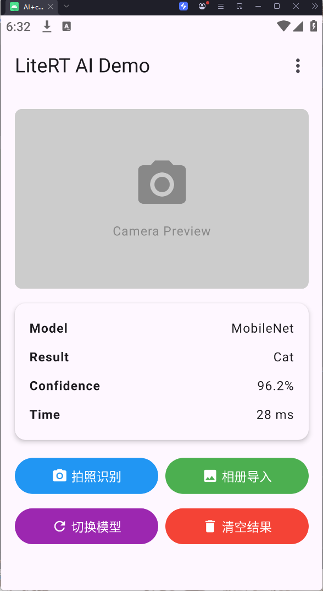

# AICompose - Jetpack Compose 应用开发实验

## 📋 实验信息

- **实验编号**: 实验 2.2 - 任务 3
- **实验名称**: AICompose - Jetpack Compose 应用开发
- **开发环境**: Android Studio
- **开发语言**: Kotlin
- **UI 框架**: Jetpack Compose
- **设计语言**: Material Design 3

---

## 📖 项目简介

AICompose 是一个基于 Android Jetpack Compose 开发的现代化 Android 应用程序，展示了一个 AI 图像识别应用的界面实现。该项目采用了最新的声明式 UI 框架，通过简洁的代码实现了 Material Design 3 的现代化设计风格。

### 应用功能

- 📷 **相机预览区域**: 显示相机实时预览画面
- 🤖 **AI 模型识别**: 使用 MobileNet 模型进行图像识别
- 📊 **结果显示**: 展示识别结果、置信度和处理时间
- 🎨 **Material Design 3**: 遵循最新的 Material You 设计规范
- 🌙 **动态主题**: 支持动态配色和主题定制

---

## 🖼️ 应用截图

### 🎨 应用主页面



*图 1: AICompose 应用主页面，展示 Jetpack Compose 和 Material Design 3 的用户界面*

---

## 🏗️ 项目结构详解

```
AIcompose/
├── app/                          # 应用主模块
│   ├── src/
│   │   ├── main/
│   │   │   ├── java/com/example/aicompose/
│   │   │   │   ├── MainActivity.kt          # 主活动 - 应用入口和 UI 主布局
│   │   │   │   └── ui/theme/                # 主题相关目录
│   │   │   │       ├── Color.kt             # 颜色定义 - 浅色和深色主题配色
│   │   │   │       ├── Theme.kt             # 主题配置 - 主题切换逻辑
│   │   │   │       └── Type.kt              # 字体排版 - 文本样式定义
│   │   │   ├── res/
│   │   │   │   ├── drawable/                # 可绘制资源
│   │   │   │   ├── mipmap-*/                # 应用图标 (多分辨率)
│   │   │   │   └── values/                  # 字符串、颜色、主题资源
│   │   │   └── AndroidManifest.xml          # 应用配置清单
│   │   ├── androidTest/                     # 仪器测试代码
│   │   └── test/                            # 单元测试代码
│   └── build.gradle.kts                     # 模块级构建配置
├── gradle/
│   ├── libs.versions.toml                   # 版本目录 - 统一依赖版本管理
│   └── wrapper/
├── build.gradle.kts                         # 项目级构建配置
└── settings.gradle.kts                      # 项目设置
```

---

## 💻 核心代码详解

### 1️⃣ MainActivity.kt - 主活动文件

这是应用的核心文件，包含了整个 UI 界面的实现。

#### 1.1 导入部分

```kotlin
package com.example.aicompose

import android.os.Bundle
import androidx.activity.ComponentActivity
import androidx.activity.compose.setContent
import androidx.activity.enableEdgeToEdge
import androidx.compose.foundation.background
import androidx.compose.foundation.layout.*
import androidx.compose.foundation.shape.RoundedCornerShape
import androidx.compose.material.icons.Icons
import androidx.compose.material.icons.filled.*
import androidx.compose.material3.*
import androidx.compose.runtime.Composable
import androidx.compose.runtime.mutableStateOf
import androidx.compose.runtime.remember
import androidx.compose.ui.Alignment
import androidx.compose.ui.Modifier
import androidx.compose.ui.draw.clip
import androidx.compose.ui.graphics.Color
import androidx.compose.ui.text.font.FontWeight
import androidx.compose.ui.tooling.preview.Preview
import androidx.compose.ui.unit.dp
import androidx.compose.ui.unit.sp
import com.example.aicompose.ui.theme.AIcomposeTheme
```

**代码解释**:
- `package com.example.aicompose`: 定义包名，这是 Kotlin 的标准包声明方式
- `androidx.activity.ComponentActivity`: Android 的组件活动类，是所有 Activity 的基类
- `enableEdgeToEdge()`: 启用边缘到边缘的显示模式，让内容延伸到系统栏下方
- `setContent`: Jetpack Compose 的核心方法，用于设置 Compose UI 内容
- `@Composable`: Compose 注解，标记该函数为可组合函数，可以构建 UI 组件
- `mutableStateOf`: 创建可变状态，用于 UI 状态管理
- `remember`: 记住状态值，在重组时保持状态不丢失
- `Modifier`: 修饰符，用于装饰和配置 Composable 组件
- `Icons.Filled.*`: Material 图标库，提供常用的图标资源

#### 1.2 MainActivity 类

```kotlin
class MainActivity : ComponentActivity() {
    override fun onCreate(savedInstanceState: Bundle?) {
        super.onCreate(savedInstanceState)
        enableEdgeToEdge()  // 启用边缘到边缘显示
        setContent {
            AIcomposeTheme {  // 应用主题包装器
                AILayout()    // 主布局函数
            }
        }
    }
}
```

**代码解释**:
- `class MainActivity : ComponentActivity()`: 定义 MainActivity 类，继承自 ComponentActivity
- `onCreate()`: Activity 的生命周期方法，在 Activity 创建时调用
- `enableEdgeToEdge()`: 让应用内容延伸到状态栏和导航栏下方，实现沉浸式效果
- `setContent {}`: Jetpack Compose 的入口方法，Lambda 表达式内定义 UI 内容
- `AIcomposeTheme {}`: 主题包装器，为内部所有组件提供主题样式
- `AILayout()`: 调用主布局函数，构建实际 UI 界面

**执行流程**:
1. Activity 创建时调用 `onCreate()`
2. 启用边缘到边缘显示模式
3. 通过 `setContent` 设置 Compose UI
4. 应用 `AIcomposeTheme` 主题
5. 渲染 `AILayout` 布局

#### 1.3 AILayout 主布局函数

```kotlin
@OptIn(ExperimentalMaterial3Api::class)
@Composable
fun AILayout() {
    // 定义状态变量
    val modelName = remember { mutableStateOf("MobileNet") }
    val result = remember { mutableStateOf("Cat") }
    val confidence = remember { mutableStateOf("96.2%") }
    val time = remember { mutableStateOf("28 ms") }

    Scaffold(
        modifier = Modifier.fillMaxSize(),
        topBar = {
            TopAppBar(
                title = { Text("LiteRT AI Demo") },
                actions = {
                    IconButton(onClick = { }) {
                        Icon(Icons.Default.MoreVert, contentDescription = "More")
                    }
                }
            )
        }
    ) { paddingValues ->
        // 主内容区域
    }
}
```

**代码解释**:
- `@OptIn(ExperimentalMaterial3Api::class)`: 注解，表示使用实验性的 Material 3 API
- `@Composable`: 标记为可组合函数，可以构建 UI
- `remember { mutableStateOf(...) }`: 创建并记住一个可变状态对象
  - `remember`: 在重组时保持值不变
  - `mutableStateOf`: 创建可观察的状态对象，当值变化时自动触发重组
- `Scaffold`: Material Design 的骨架布局，提供标准的 UI 结构（顶栏、底栏、内容等）
  - `modifier = Modifier.fillMaxSize()`: 填充整个屏幕大小
  - `topBar`: 顶部应用栏
- `TopAppBar`: 顶部应用栏组件
  - `title`: 标题内容
  - `actions`: 右侧操作按钮
- `IconButton`: 图标按钮，可点击的图标
- `paddingValues`: Scaffold 提供的内边距，用于避免内容被顶栏遮挡

**状态管理原理**:
- Jetpack Compose 使用响应式编程模型
- 当 `mutableStateOf` 的值改变时，使用该状态的所有 Composable 会自动重组
- `remember` 确保在重组过程中状态值不会丢失

#### 1.4 Column 布局容器

```kotlin
Column(
    modifier = Modifier
        .fillMaxSize()
        .padding(paddingValues)
        .padding(16.dp),
    verticalArrangement = Arrangement.spacedBy(16.dp)
) {
    PreviewSection()
    ResultSection(
        modelName = modelName.value,
        result = result.value,
        confidence = confidence.value,
        time = time.value
    )
    ButtonSection(
        onPhotoClick = { },
        onAlbumClick = { },
        onSwitchModelClick = { },
        onClearClick = {
            result.value = ""
            confidence.value = ""
            time.value = ""
        }
    )
}
```

**代码解释**:
- `Column`: 垂直布局容器，子元素从上到下排列
- `modifier`: 修饰符链，按顺序应用多个修饰效果
  - `fillMaxSize()`: 填充父容器的全部大小
  - `padding(paddingValues)`: 应用 Scaffold 的内边距
  - `padding(16.dp)`: 额外添加 16dp 的内边距
- `verticalArrangement = Arrangement.spacedBy(16.dp)`: 垂直排列方式，子元素间距 16dp
- `PreviewSection()`: 调用预览区域组件
- `ResultSection(...)`: 调用结果显示组件，传入状态值
- `ButtonSection(...)`: 调用按钮区域组件，传入点击回调
- `.value`: 访问 `mutableStateOf` 的实际值

**布局层次**:
```
Scaffold
└── Column (垂直布局)
    ├── PreviewSection (预览区域)
    ├── ResultSection (结果卡片)
    └── ButtonSection (按钮组)
```

#### 1.5 PreviewSection 预览组件

```kotlin
@Composable
fun PreviewSection() {
    Box(
        modifier = Modifier
            .fillMaxWidth()
            .height(200.dp)
            .clip(RoundedCornerShape(8.dp))
            .background(Color.LightGray),
        contentAlignment = Alignment.Center
    ) {
        Column(
            horizontalAlignment = Alignment.CenterHorizontally,
            verticalArrangement = Arrangement.Center
        ) {
            Icon(
                imageVector = Icons.Filled.CameraAlt,
                contentDescription = "Camera",
                modifier = Modifier.size(64.dp),
                tint = Color.Gray
            )
            Spacer(modifier = Modifier.height(8.dp))
            Text(
                text = "Camera Preview",
                color = Color.Gray,
                fontSize = 14.sp
            )
        }
    }
}
```

**代码解释**:
- `@Composable`: 可组合函数注解
- `Box`: 堆叠布局容器，子元素可以重叠
  - `fillMaxWidth()`: 填充最大宽度
  - `height(200.dp)`: 固定高度 200dp
  - `clip(RoundedCornerShape(8.dp))`: 裁剪为圆角矩形，圆角半径 8dp
  - `background(Color.LightGray)`: 浅灰色背景
  - `contentAlignment = Alignment.Center`: 内容居中对齐
- `Column`: 内部垂直布局
  - `horizontalAlignment = Alignment.CenterHorizontally`: 水平居中
  - `verticalArrangement = Arrangement.Center`: 垂直居中
- `Icon`: 图标组件
  - `imageVector`: 图标矢量数据
  - `contentDescription`: 无障碍描述文本
  - `modifier.size(64.dp)`: 图标大小 64dp
  - `tint`: 图标颜色
- `Spacer`: 占位符，用于添加间距
  - `height(8.dp)`: 高度 8dp
- `Text`: 文本组件
  - `text`: 文本内容
  - `color`: 文本颜色
  - `fontSize`: 字体大小 14sp

**视觉效果**: 创建一个圆角矩形灰色区域，中间显示相机图标和"Camera Preview"文字

#### 1.6 ResultSection 结果卡片

```kotlin
@Composable
fun ResultSection(
    modelName: String,
    result: String,
    confidence: String,
    time: String
) {
    Card(
        modifier = Modifier.fillMaxWidth(),
        elevation = CardDefaults.cardElevation(defaultElevation = 4.dp),        
        colors = CardDefaults.cardColors(containerColor = MaterialTheme.colorScheme.surface)
    ) {
        Column(
            modifier = Modifier.padding(16.dp),
            verticalArrangement = Arrangement.spacedBy(8.dp)
        ) {
            ResultRow(label = "Model", value = modelName)
            ResultRow(label = "Result", value = result)
            ResultRow(label = "Confidence", value = confidence)
            ResultRow(label = "Time", value = time)
        }
    }
}
```

**代码解释**:
- `Card`: Material Design 卡片组件，带阴影和圆角
  - `fillMaxWidth()`: 填充最大宽度
  - `elevation`: 卡片 elevation（阴影高度）4dp
  - `containerColor`: 卡片背景色，使用主题的表面色
- `MaterialTheme.colorScheme.surface`: 从主题获取表面颜色
- `Column`: 垂直布局容器
  - `padding(16.dp)`: 内边距 16dp
  - `spacedBy(8.dp)`: 子元素间距 8dp
- `ResultRow`: 自定义的结果行组件，显示标签和值

**设计特点**:
- 使用卡片组件提升视觉层次
- 统一的间距和内边距
- 遵循 Material Design 的 elevation 系统

#### 1.7 ResultRow 结果行组件

```kotlin
@Composable
fun ResultRow(label: String, value: String) {
    Row(
        modifier = Modifier.fillMaxWidth(),
        horizontalArrangement = Arrangement.SpaceBetween
    ) {
        Text(
            text = label,
            fontWeight = FontWeight.Bold,
            fontSize = 14.sp
        )
        Text(
            text = value,
            fontSize = 14.sp
        )
    }
}
```

**代码解释**:
- `Row`: 水平布局容器，子元素从左到右排列
  - `fillMaxWidth()`: 填充最大宽度
  - `horizontalArrangement = Arrangement.SpaceBetween`: 两端对齐，标签在左，值在右
- `Text` (标签): 
  - `fontWeight = FontWeight.Bold`: 粗体显示标签
  - `fontSize = 14.sp`: 字体大小 14sp
- `Text` (值):
  - 普通字体显示值

**布局效果**:
```
Model          MobileNet
Result         Cat
Confidence     96.2%
Time           28 ms
```

#### 1.8 ButtonSection 按钮区域

```kotlin
@Composable
fun ButtonSection(
    onPhotoClick: () -> Unit,
    onAlbumClick: () -> Unit,
    onSwitchModelClick: () -> Unit,
    onClearClick: () -> Unit
) {
    Column(
        verticalArrangement = Arrangement.spacedBy(8.dp)
    ) {
        // 第一行按钮
        Row(
            horizontalArrangement = Arrangement.spacedBy(8.dp),
            modifier = Modifier.fillMaxWidth()
        ) {
            Button(
                onClick = onPhotoClick,
                modifier = Modifier.weight(1f),
                colors = ButtonDefaults.buttonColors(
                    containerColor = Color(0xFF2196F3)
                )
            ) {
                Icon(
                    imageVector = Icons.Filled.CameraAlt,
                    contentDescription = null,
                    modifier = Modifier.size(18.dp)
                )
                Spacer(modifier = Modifier.width(4.dp))
                Text("拍照识别")
            }

            Button(
                onClick = onAlbumClick,
                modifier = Modifier.weight(1f),
                colors = ButtonDefaults.buttonColors(
                    containerColor = Color(0xFF4CAF50)
                )
            ) {
                Icon(
                    imageVector = Icons.Filled.Image,
                    contentDescription = null,
                    modifier = Modifier.size(18.dp)
                )
                Spacer(modifier = Modifier.width(4.dp))
                Text("相册导入")
            }
        }

        // 第二行按钮
        Row(
            horizontalArrangement = Arrangement.spacedBy(8.dp),
            modifier = Modifier.fillMaxWidth()
        ) {
            Button(
                onClick = onSwitchModelClick,
                modifier = Modifier.weight(1f),
                colors = ButtonDefaults.buttonColors(
                    containerColor = Color(0xFF9C27B0)
                )
            ) {
                Icon(
                    imageVector = Icons.Filled.Refresh,
                    contentDescription = null,
                    modifier = Modifier.size(18.dp)
                )
                Spacer(modifier = Modifier.width(4.dp))
                Text("切换模型")
            }

            Button(
                onClick = onClearClick,
                modifier = Modifier.weight(1f),
                colors = ButtonDefaults.buttonColors(
                    containerColor = Color(0xFFF44336)
                )
            ) {
                Icon(
                    imageVector = Icons.Filled.Delete,
                    contentDescription = null,
                    modifier = Modifier.size(18.dp)
                )
                Spacer(modifier = Modifier.width(4.dp))
                Text("清空结果")
            }
        }
    }
}
```

**代码解释**:
- 函数参数:
  - `onPhotoClick: () -> Unit`: 拍照点击回调，`() -> Unit` 表示无参数无返回的函数类型
  - `onAlbumClick: () -> Unit`: 相册点击回调
  - `onSwitchModelClick: () -> Unit`: 切换模型点击回调
  - `onClearClick: () -> Unit`: 清空结果点击回调

- `Column`: 外层垂直布局，按钮行间距 8dp

- `Row` (按钮行):
  - `fillMaxWidth()`: 填充整行宽度
  - `spacedBy(8.dp)`: 按钮之间间距 8dp

- `Button`: Material 3 按钮组件
  - `onClick`: 点击事件处理函数
  - `modifier.weight(1f)`: 权重 1f，两个按钮平分宽度
  - `containerColor`: 按钮背景颜色
    - `Color(0xFF2196F3)`: 蓝色 (拍照识别)
    - `Color(0xFF4CAF50)`: 绿色 (相册导入)
    - `Color(0xFF9C27B0)`: 紫色 (切换模型)
    - `Color(0xFFF44336)`: 红色 (清空结果)

- 按钮内容:
  - `Icon`: 左侧图标，18dp 大小
  - `Spacer(width(4.dp))`: 图标和文字之间的间距
  - `Text`: 按钮文字

**按钮功能**:
1. **拍照识别** (蓝色): 调用相机进行实时识别
2. **相册导入** (绿色): 从相册选择图片进行识别
3. **切换模型** (紫色): 切换不同的 AI 模型
4. **清空结果** (红色): 清空识别结果显示

#### 1.9 预览函数

```kotlin
@Preview(showBackground = true)
@Composable
fun AILayoutPreview() {
    AIcomposeTheme {
        AILayout()
    }
}
```

**代码解释**:
- `@Preview`: Compose 预览注解，在 Android Studio 中显示组件预览
  - `showBackground = true`: 显示背景
- `AIcomposeTheme`: 应用主题包装器
- `AILayout()`: 渲染主布局

**作用**: 允许在 Android Studio 中不运行应用即可预览 UI 效果，支持实时预览和交互

---

### 2️⃣ Color.kt - 颜色定义

```kotlin
package com.example.aicompose.ui.theme

import androidx.compose.ui.graphics.Color

// Material Design 3 浅色主题配色
val Purple80 = Color(0xFFD0BCFF)  // 浅紫色 - 浅色主题主色
val PurpleGrey80 = Color(0xFFCCC2DC)  // 紫灰色 - 浅色主题次要色
val Pink80 = Color(0xFFEFB8C8)  // 粉色 - 浅色主题强调色

// Material Design 3 深色主题配色
val Purple40 = Color(0xFF6650a4)  // 深紫色 - 深色主题主色
val PurpleGrey40 = Color(0xFF625b71)  // 深紫灰 - 深色主题次要色
val Pink40 = Color(0xFF7D5260)  // 深粉色 - 深色主题强调色
```

**代码解释**:
- `val`: Kotlin 的不可变变量声明
- `Color(0xFF...)`: 创建颜色对象，格式为 0xFFAARRGGBB
  - `FF`: Alpha 通道 (不透明度)，FF 表示完全不透明
  - `RR`: 红色通道
  - `GG`: 绿色通道
  - `BB`: 蓝色通道
- 命名规则:
  - `80` 结尾: 浅色主题配色 (light theme)
  - `40` 结尾: 深色主题配色 (dark theme)

**颜色用途**:
- `Purple`: 主色 (Primary) - 用于主要按钮、选中状态等
- `PurpleGrey`: 次要色 (Secondary) - 用于次要元素
- `Pink`: 强调色 (Tertiary) - 用于特殊强调元素

---

### 3️⃣ Theme.kt - 主题配置

```kotlin
package com.example.aicompose.ui.theme

import android.app.Activity
import android.os.Build
import androidx.compose.foundation.isSystemInDarkTheme
import androidx.compose.material3.MaterialTheme
import androidx.compose.material3.darkColorScheme
import androidx.compose.material3.dynamicDarkColorScheme
import androidx.compose.material3.dynamicLightColorScheme
import androidx.compose.material3.lightColorScheme
import androidx.compose.runtime.Composable
import androidx.compose.ui.platform.LocalContext

// 深色主题配色方案
private val DarkColorScheme = darkColorScheme(
    primary = Purple80,
    secondary = PurpleGrey80,
    tertiary = Pink80
)

// 浅色主题配色方案
private val LightColorScheme = lightColorScheme(
    primary = Purple40,
    secondary = PurpleGrey40,
    tertiary = Pink40
)
```

**代码解释**:
- `darkColorScheme()`: 创建深色主题配色方案
- `lightColorScheme()`: 创建浅色主题配色方案
- `primary/secondary/tertiary`: 主题的主要、次要、强调颜色

```kotlin
@Composable
fun AIcomposeTheme(
    darkTheme: Boolean = isSystemInDarkTheme(),
    dynamicColor: Boolean = true,
    content: @Composable () -> Unit
) {
    val colorScheme = when {
        // Android 12+ 支持动态配色
        dynamicColor && Build.VERSION.SDK_INT >= Build.VERSION_CODES.S -> {
            val context = LocalContext.current
            if (darkTheme) dynamicDarkColorScheme(context) 
            else dynamicLightColorScheme(context)
        }
        // 深色主题
        darkTheme -> DarkColorScheme
        // 浅色主题
        else -> LightColorScheme
    }

    MaterialTheme(
        colorScheme = colorScheme,
        typography = Typography,
        content = content
    )
}
```

**代码解释**:
- `AIcomposeTheme`: 自定义主题函数
  - `darkTheme`: 是否使用深色主题，默认为系统设置
  - `dynamicColor`: 是否启用动态配色 (Android 12+ 特性)
  - `content`: 主题内容，Lambda 表达式

- `isSystemInDarkTheme()`: 检测系统是否为深色模式

- `when`: Kotlin 的条件表达式，类似 switch
  - 第一个条件：动态配色 + Android 12+ → 使用动态配色
  - 第二个条件：深色主题 → 使用深色配色方案
  - 默认：浅色主题 → 使用浅色配色方案

- `LocalContext.current`: 获取当前上下文

- `MaterialTheme`: Material Design 3 主题包装器
  - `colorScheme`: 配色方案
  - `typography`: 排版样式
  - `content`: 主题内容

**主题选择逻辑**:
```
1. 检查是否启用动态配色 AND Android 版本 >= 12
   └─ 是 → 使用动态配色 (基于壁纸颜色)
   └─ 否 → 继续检查
2. 检查是否为深色模式
   └─ 是 → 使用深色配色方案
   └─ 否 → 使用浅色配色方案
```

---

### 4️⃣ Type.kt - 字体排版

```kotlin
package com.example.aicompose.ui.theme

import androidx.compose.material3.Typography
import androidx.compose.ui.text.TextStyle
import androidx.compose.ui.text.font.FontFamily
import androidx.compose.ui.text.font.FontWeight
import androidx.compose.ui.unit.sp

// Material 排版样式定义
val Typography = Typography(
    bodyLarge = TextStyle(
        fontFamily = FontFamily.Default,  // 默认字体
        fontWeight = FontWeight.Normal,   // 正常字重
        fontSize = 16.sp,                 // 字体大小 16sp
        lineHeight = 24.sp,               // 行高 24sp
        letterSpacing = 0.5.sp            // 字间距 0.5sp
    )
)
```

**代码解释**:
- `Typography`: Material Design 的排版系统，定义各种文本样式
- `TextStyle`: 文本样式对象
  - `fontFamily`: 字体系列，`Default` 使用系统默认字体
  - `fontWeight`: 字重 (粗细)，`Normal` 为正常
  - `fontSize`: 字体大小，单位 sp (可缩放像素)
  - `lineHeight`: 行高，控制行间距
  - `letterSpacing`: 字母间距

**可用文本样式** (注释部分):
- `titleLarge`: 大标题 (22sp)
- `bodyLarge`: 大正文 (16sp)
- `labelSmall`: 小标签 (11sp)

**sp 单位**: Scalable Pixels，根据用户字体大小设置自动缩放，适合正文文本

---

### 5️⃣ build.gradle.kts - 构建配置

```kotlin
plugins {
    alias(libs.plugins.android.application)    // Android 应用插件
    alias(libs.plugins.kotlin.android)         // Kotlin Android 插件
    alias(libs.plugins.kotlin.compose)         // Kotlin Compose 插件
}

android {
    namespace = "com.example.aicompose"        // 包名空间
    compileSdk = 36                            // 编译 SDK 版本

    defaultConfig {
        applicationId = "com.example.aicompose"  // 应用 ID
        minSdk = 24                              // 最低支持 SDK (Android 7.0)
        targetSdk = 36                           // 目标 SDK (Android 14)
        versionCode = 1                          // 版本号 (整数)
        versionName = "1.0"                      // 版本名称 (字符串)
        testInstrumentationRunner = "androidx.test.runner.AndroidJUnitRunner"
    }

    buildTypes {
        release {
            isMinifyEnabled = false              // 是否启用代码压缩
            proguardFiles(...)                   // ProGuard 规则文件
        }
    }

    compileOptions {
        sourceCompatibility = JavaVersion.VERSION_11
        targetCompatibility = JavaVersion.VERSION_11
    }

    kotlinOptions {
        jvmTarget = "11"                         // JVM 目标版本
    }

    buildFeatures {
        compose = true                           // 启用 Jetpack Compose
    }
}
```

**依赖配置**:
```kotlin
dependencies {
    // Android 核心库
    implementation(libs.androidx.core.ktx)
    implementation(libs.androidx.lifecycle.runtime.ktx)
    implementation(libs.androidx.activity.compose)
    
    // Compose BOM (物料清单) - 确保版本兼容
    implementation(platform(libs.androidx.compose.bom))
    
    // Compose UI 核心
    implementation(libs.androidx.compose.ui)
    implementation(libs.androidx.compose.ui.graphics)
    implementation(libs.androidx.compose.ui.tooling.preview)
    
    // Material 3 组件
    implementation(libs.androidx.compose.material3)
    
    // 测试依赖
    testImplementation(libs.junit)
    androidTestImplementation(libs.androidx.junit)
    androidTestImplementation(libs.androidx.espresso.core)
    
    // Compose 测试
    androidTestImplementation(platform(libs.androidx.compose.bom))
    androidTestImplementation(libs.androidx.compose.ui.test.junit4)
    
    // 调试工具
    debugImplementation(libs.androidx.compose.ui.tooling)
    debugImplementation(libs.androidx.compose.ui.test.manifest)
}
```

**关键概念**:
- `compileSdk`: 编译时使用的 SDK 版本
- `minSdk`: 应用支持的最低 Android 版本
- `targetSdk`: 应用针对的 Android 版本
- `versionCode`: 内部版本号，用于更新判断
- `versionName`: 用户可见的版本号
- `BOM`: Bill of Materials，确保 Compose 库版本兼容性

---

### 6️⃣ libs.versions.toml - 版本目录

```toml
[versions]
agp = "8.13.2"              # Android Gradle Plugin 版本
kotlin = "2.0.21"           # Kotlin 版本
coreKtx = "1.18.0"          # AndroidX Core KTX 版本
junit = "4.13.2"            # JUnit 版本
junitVersion = "1.3.0"      # AndroidX JUnit 版本
espressoCore = "3.7.0"      # Espresso 测试版本
lifecycleRuntimeKtx = "2.10.0"
activityCompose = "1.13.0"
composeBom = "2024.09.00"   # Compose BOM 版本

[libraries]
# 依赖库定义
androidx-core-ktx = { group = "androidx.core", name = "core-ktx", version.ref = "coreKtx" }
androidx-compose-bom = { group = "androidx.compose", name = "compose-bom", version.ref = "composeBom" }
androidx-compose-ui = { group = "androidx.compose.ui", name = "ui" }
androidx-compose-material3 = { group = "androidx.compose.material3", name = "material3" }
# ... 更多依赖

[plugins]
# 插件定义
android-application = { id = "com.android.application", version.ref = "agp" }
kotlin-android = { id = "org.jetbrains.kotlin.android", version.ref = "kotlin" }
kotlin-compose = { id = "org.jetbrains.kotlin.plugin.compose", version.ref = "kotlin" }
```

**优点**:
- 集中管理所有依赖版本
- 避免版本号重复和冲突
- 便于版本升级和维护
- 类型安全的依赖引用

---

### 7️⃣ AndroidManifest.xml - 应用清单

```xml
<?xml version="1.0" encoding="utf-8"?>
<manifest xmlns:android="http://schemas.android.com/apk/res/android"
    xmlns:tools="http://schemas.android.com/tools">

    <application
        android:allowBackup="true"                      # 允许备份
        android:dataExtractionRules="@xml/data_extraction_rules"
        android:fullBackupContent="@xml/backup_rules"
        android:icon="@mipmap/ic_launcher"              # 应用图标
        android:label="@string/app_name"                # 应用名称
        android:roundIcon="@mipmap/ic_launcher_round"   # 圆形图标
        android:supportsRtl="true"                      # 支持从右到左语言
        android:theme="@style/Theme.AIcompose">         # 应用主题
        
        <activity
            android:name=".MainActivity"                # 活动类名
            android:exported="true"                     # 可被其他应用启动
            android:label="@string/app_name"
            android:theme="@style/Theme.AIcompose">
            <intent-filter>
                <action android:name="android.intent.action.MAIN" />
                <category android:name="android.intent.category.LAUNCHER" />
            </intent-filter>
        </activity>
    </application>
</manifest>
```

**关键配置**:
- `intent-filter`: 定义 Activity 如何被启动
  - `MAIN` action: 应用的主入口点
  - `LAUNCHER` category: 在应用启动器中显示

---

## 🚀 Jetpack Compose 核心概念详解

### 1. Composable 函数

```kotlin
@Composable
fun Greeting(name: String) {
    Text(text = "Hello $name!")
}
```

**特点**:
- `@Composable` 注解标记
- 可以调用其他 Composable 函数
- 只能生成 UI，不能返回其他值
- 支持函数参数传递数据

### 2. 状态管理

```kotlin
val count = remember { mutableStateOf(0) }

// 使用状态
Text("Count: ${count.value}")

// 更新状态 (自动触发重组)
count.value++
```

**核心概念**:
- `remember`: 记住值，在重组时保持不变
- `mutableStateOf`: 创建可观察状态
- 状态变化 → 自动重组使用状态的 Composable
- 单向数据流：事件向上，状态向下

### 3. 重组 (Recomposition)

当状态改变时，Compose 自动重新执行受影响的 Composable 函数：

```
状态变化 → 检测依赖 → 重组相关组件 → 更新 UI
```

**优势**:
- 自动 UI 更新
- 智能重组 (只更新变化的部分)
- 无需手动刷新

### 4. Modifier 修饰符

```kotlin
Text(
    text = "Hello",
    modifier = Modifier
        .fillMaxWidth()      // 填充宽度
        .padding(16.dp)      // 内边距
        .background(Color.Blue)  // 背景色
        .clickable { }       // 可点击
)
```

**作用**:
- 装饰组件 (大小、间距、背景等)
- 添加交互 (点击、滚动等)
- 修饰符链式调用，顺序重要

### 5. 布局组件

| 布局 | 排列方式 | 用途 |
|------|---------|------|
| `Column` | 垂直 | 从上到下排列 |
| `Row` | 水平 | 从左到右排列 |
| `Box` | 堆叠 | 元素重叠 |
| `Scaffold` | Material 结构 | 标准应用布局 |

---

## 🎨 Material Design 3 特性

### 动态配色 (Dynamic Color)

Android 12+ 可以根据壁纸颜色自动生成主题配色：

```kotlin
if (Build.VERSION.SDK_INT >= Build.VERSION_CODES.S) {
    dynamicColorScheme(context)  // 基于壁纸生成配色
}
```

### 颜色方案 (Color Scheme)

Material 3 定义了完整的颜色系统：
- `primary`: 主色
- `secondary`: 次要色
- `tertiary`: 强调色
- `background`: 背景色
- `surface`: 表面色
- `error`: 错误色

### 组件样式

所有 Material 组件自动遵循主题:
- `Button`: 使用主色
- `Card`: 使用表面色
- `Text`: 使用主题字体和颜色

---

## 📦 技术栈总览

| 技术 | 版本 | 用途 |
|------|------|------|
| **语言** | Kotlin | 主要编程语言 |
| **最低 SDK** | Android 7.0 (API 24) | 最低支持版本 |
| **目标 SDK** | Android 14 (API 34) | 优化目标版本 |
| **UI 框架** | Jetpack Compose | 声明式 UI |
| **设计语言** | Material Design 3 | 设计规范 |
| **构建工具** | Gradle Kotlin DSL | 构建系统 |
| **依赖管理** | Version Catalog | 版本管理 |

---

## 🛠️ 主要依赖说明

### 核心依赖

1. **androidx.compose.ui** - Compose UI 核心
   - 基础 UI 组件和布局

2. **androidx.compose.material3** - Material 3 组件
   - Material Design 3 实现

3. **androidx.activity:activity-compose** - Activity 集成
   - Compose 与 Activity 的桥接

4. **androidx.lifecycle:lifecycle-runtime-ktx** - 生命周期
   - 生命周期感知组件

### 开发工具

5. **androidx.compose.ui.tooling.preview** - 预览工具
   - Android Studio 实时预览

6. **androidx.compose.ui.test** - 测试框架
   - UI 测试支持

---

## 📱 运行环境要求

### 开发环境

- **Android Studio**: Hedgehog (2023.1.1) 或更高版本
- **JDK**: 17 或更高版本
- **Gradle**: 8.0 或更高版本
- **Kotlin**: 2.0.21

### 测试设备

- **Android 设备**: API 24+ (Android 7.0+)
- **模拟器**: Android Studio 自带模拟器
- **推荐**: 使用真机测试获得最佳体验

---

## 🔧 构建与运行步骤

### 1. 获取项目

```bash
# 克隆或下载项目
git clone <repository-url>
# 或直接从实验包获取
```

### 2. 打开项目

```
1. 启动 Android Studio
2. File → Open
3. 选择 AIcompose 目录
4. 等待 Gradle 同步完成
```

### 3. 配置设备

```
1. 连接 Android 设备 (USB 调试开启)
   或
2. 启动 Android 模拟器 (API 24+)
```

### 4. 运行应用

```
1. 点击工具栏的绿色运行按钮 (▶)
2. 或使用快捷键 Shift + F10
3. 选择目标设备
4. 等待编译和安装
```

### 5. 查看效果

应用启动后即可看到:
- Material Design 3 界面
- 相机预览区域
- AI 识别结果展示
- 四个功能按钮

---

## 🎯 核心功能模块

### 1. 相机预览模块

```kotlin
@Composable
fun PreviewSection() {
    // 200dp 高度的圆角矩形区域
    // 显示相机图标和"Camera Preview"文字
}
```

**功能**: 
- 显示实时相机画面
- 圆角边框设计
- 灰色占位符 (实际需接入相机 API)

### 2. 结果显示模块

```kotlin
@Composable
fun ResultSection(modelName, result, confidence, time) {
    // 卡片形式展示
    // - 模型名称
    // - 识别结果
    // - 置信度
    // - 处理时间
}
```

**显示内容**:
- Model: MobileNet (AI 模型名称)
- Result: Cat (识别结果)
- Confidence: 96.2% (置信度)
- Time: 28 ms (处理时间)

### 3. 操作按钮模块

```kotlin
@Composable
fun ButtonSection(onPhotoClick, onAlbumClick, onSwitchModelClick, onClearClick) {
    // 两行四按钮布局
    // 1. 拍照识别 (蓝色)
    // 2. 相册导入 (绿色)
    // 3. 切换模型 (紫色)
    // 4. 清空结果 (红色)
}
```

**按钮功能**:
- **拍照识别**: 调用相机 API 拍摄并识别
- **相册导入**: 选择本地图片识别
- **切换模型**: 更换 AI 模型 (如 MobileNet → EfficientNet)
- **清空结果**: 重置显示数据

---

## 💡 Jetpack Compose 优势

### 1. 声明式编程

**传统 View 系统** (命令式):
```kotlin
val textView = TextView(context)
textView.text = "Hello"
textView.textSize = 16f
textView.setPadding(16, 16, 16, 16)
layout.addView(textView)
```

**Jetpack Compose** (声明式):
```kotlin
Text(
    text = "Hello",
    fontSize = 16.sp,
    modifier = Modifier.padding(16.dp)
)
```

**优势**: 代码减少 50%+, 更易读易维护

### 2. 更少的代码

- 无需 XML 布局文件
- 无需 `findViewById()`
- 无需适配器 (Adapter)
- 天然支持 Kotlin 特性

### 3. 强大的工具支持

- **实时预览**: @Preview 注解即时查看效果
- **交互预览**: 预览中直接点击测试
- **状态检查**: Layout Inspector 查看状态
- **动画预览**: 动画效果可视化

### 4. 与现有代码兼容

```kotlin
// Compose 中使用 View
AndroidView(factory = { context ->
    TextView(context)
})

// View 中使用 Compose
composeView.setContent {
    MyComposable()
}
```

### 5. 响应式编程

```kotlin
// 状态自动触发 UI 更新
val count = remember { mutableStateOf(0) }

Button(onClick = { count.value++ }) {
    Text("Clicked: ${count.value}")  // 自动更新
}
```

---

## ⚠️ 注意事项

### 开发注意

1. **Android Studio 版本**
   - 需要 Hedgehog (2023.1.1) 或更高
   - 旧版本可能不支持 Compose 预览

2. **JDK 版本要求**
   - 必须 JDK 17+
   - 低版本会导致编译错误

3. **依赖版本兼容性**
   - 使用 Compose BOM 管理版本
   - 避免版本冲突

### 兼容性注意

1. **最低 SDK**: API 24 (Android 7.0)
   - 部分旧设备不支持

2. **动态配色**: Android 12+ (API 31)
   - 低版本自动降级为标准配色

3. **性能优化**
   - 避免在 Composable 中执行耗时操作
   - 使用 `derivedStateOf` 优化计算

### 测试建议

1. **真机测试**: 模拟器性能可能不如真机
2. **多设备测试**: 测试不同屏幕尺寸
3. **深色模式**: 验证两种主题效果

---

## 🎓 实验总结

### 实现内容

✅ **完整的 Material Design 3 应用**
- 遵循最新设计规范
- 动态主题支持
- 现代化 UI 组件

✅ **Jetpack Compose 核心特性**
- 声明式 UI 编程
- 状态管理和重组
- Composable 组件化

✅ **响应式布局设计**
- 自适应不同屏幕
- 优雅的布局结构
- 良好的用户体验

### 技术亮点

🎨 **UI 设计**
- 卡片式布局
- 圆角和阴影效果
- 色彩搭配协调

🔧 **代码结构**
- 组件化设计
- 状态管理清晰
- 代码复用性高

📱 **用户体验**
- 直观的界面布局
- 明确的功能分区
- 流畅的交互体验

### 学习收获

通过本实验，掌握了:
1. Jetpack Compose 基础语法和概念
2. Material Design 3 设计规范
3. Android 应用开发流程
4. Kotlin 语言在 Android 中的应用
5. 声明式 UI 编程思想
