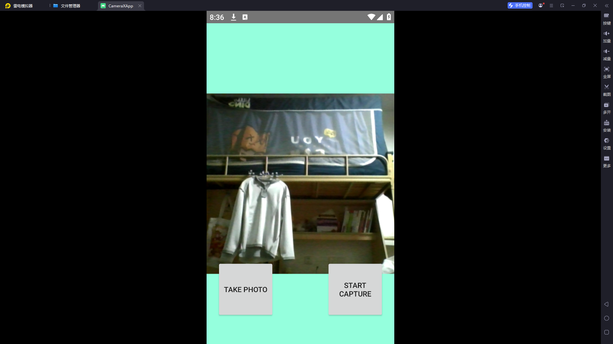
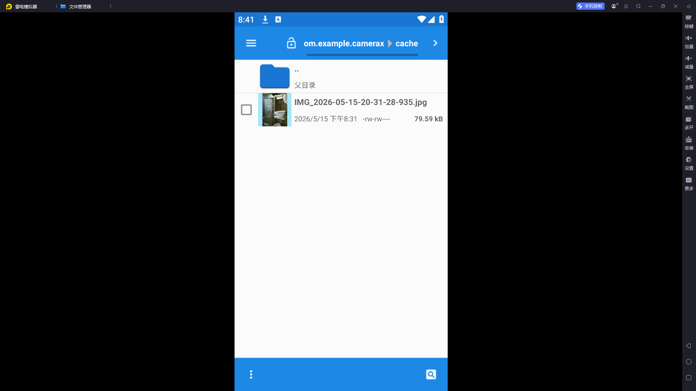
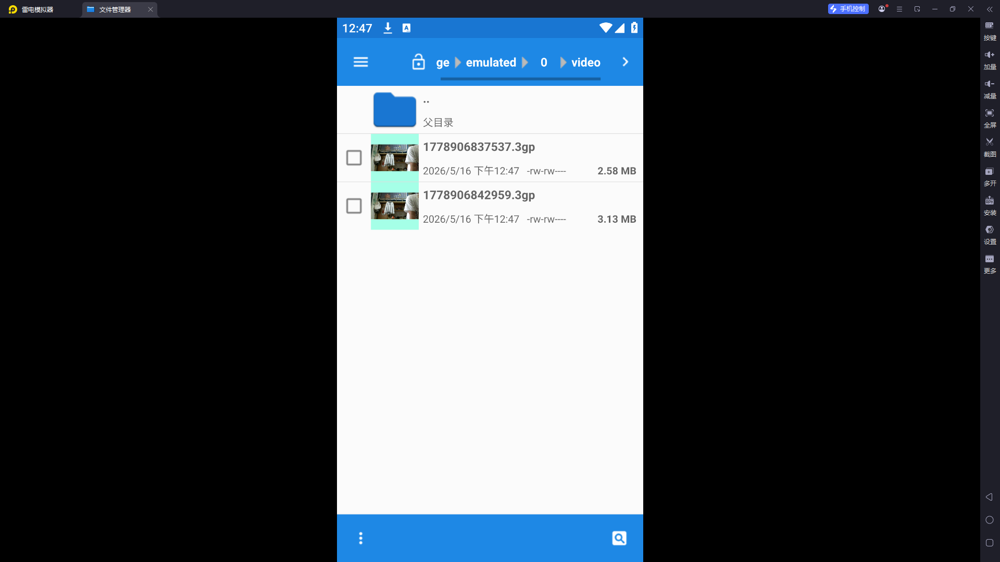

# CameraX 相机应用开发实验报告

## 实验信息

- **实验编号**: 实验 2.3
- **实验名称**: CameraX 相机应用开发
- **开发环境**: Android Studio
- **开发语言**: Kotlin
- **最低 SDK 版本**: Android 7.0 (API 24)
- **目标 SDK 版本**: Android 16 (API 36)

---

## 项目简介

本项目是一个基于 Android Jetpack CameraX API 开发的相机应用程序，实现了拍照和录像功能。CameraX 是 Android 官方推出的相机库，旨在简化相机功能的开发，提供一致且易于使用的 API。

---

## 功能特性

- 📸 **拍照功能**：支持实时预览和拍照捕获
- 🎥 **录像功能**：支持视频录制（含音频）
- 📁 **媒体存储**：照片和视频自动保存到设备相册
- 🎨 **Material Design UI**：遵循 Material Design 设计规范的用户界面
- 🔒 **权限管理**：动态请求相机和录音权限

---

## 项目结构

```
CameraX/
├── app/
│   ├── src/
│   │   ├── main/
│   │   │   ├── java/com/example/camerax/
│   │   │   │   ├── MainActivity.kt          # 主活动 - 核心相机逻辑
│   │   │   │   └── ui/theme/                # 主题相关
│   │   │   │       ├── Color.kt             # 颜色定义
│   │   │   │       ├── Theme.kt             # 主题样式
│   │   │   │       └── Type.kt              # 字体排版
│   │   │   ├── res/
│   │   │   │   ├── layout/                  # 布局文件
│   │   │   │   │   └── activity_main.xml    # 主界面布局
│   │   │   │   ├── drawable/                # 可绘制资源
│   │   │   │   ├── mipmap-*/                # 应用图标
│   │   │   │   └── values/                  # 字符串、颜色、主题
│   │   │   └── AndroidManifest.xml          # 应用清单
│   │   ├── androidTest/                     # 仪器测试
│   │   └── test/                            # 单元测试
│   └── build.gradle.kts                     # 模块构建配置
├── gradle/
└── build.gradle.kts                         # 项目构建配置
```

---

## 核心代码详解

### 1. 构建配置 (build.gradle.kts)

```kotlin
plugins {
    alias(libs.plugins.android.application)
    alias(libs.plugins.kotlin.android)
    alias(libs.plugins.kotlin.compose)
}

android {
    namespace = "com.example.camerax"
    compileSdk = 36

    defaultConfig {
        applicationId = "com.example.camerax"
        minSdk = 24
        targetSdk = 36
        versionCode = 1
        versionName = "1.0"
    }

    buildFeatures {
        compose = true
        viewBinding = true  // 启用 ViewBinding，简化视图绑定
    }
}

dependencies {
    // CameraX 核心依赖
    val camerax_version = "1.1.0-beta01"
    implementation("androidx.camera:camera-core:${camerax_version}")
    implementation("androidx.camera:camera-camera2:${camerax_version}")
    implementation("androidx.camera:camera-lifecycle:${camerax_version}")
    implementation("androidx.camera:camera-video:${camerax_version}")
    implementation("androidx.camera:camera-view:${camerax_version}")
    implementation("androidx.camera:camera-extensions:${camerax_version}")
}
```

**关键说明**：
- `viewBinding = true`：启用 ViewBinding，避免频繁使用 `findViewById`
- CameraX 包含 6 个模块：
  - `camera-core`：核心 API
  - `camera-camera2`：基于 Camera2 的实现
  - `camera-lifecycle`：生命周期感知
  - `camera-video`：视频录制功能
  - `camera-view`：预览视图
  - `camera-extensions`：扩展功能

---

### 2. 应用清单 (AndroidManifest.xml)

```xml
<?xml version="1.0" encoding="utf-8"?>
<manifest xmlns:android="http://schemas.android.com/apk/res/android">

    <!-- 声明相机功能 -->
    <uses-feature android:name="android.hardware.camera.any" />
    
    <!-- 相机权限 -->
    <uses-permission android:name="android.permission.CAMERA" />
    
    <!-- 录音权限（用于视频录制） -->
    <uses-permission android:name="android.permission.RECORD_AUDIO" />
    
    <!-- 存储权限（Android 9 及以下需要） -->
    <uses-permission android:name="android.permission.WRITE_EXTERNAL_STORAGE"
        android:maxSdkVersion="28" />

    <application>
        <activity
            android:name=".MainActivity"
            android:exported="true"
            android:label="@string/app_name"
            android:theme="@style/Theme.CameraX">
            <intent-filter>
                <action android:name="android.intent.action.MAIN" />
                <category android:name="android.intent.category.LAUNCHER" />
            </intent-filter>
        </activity>
    </application>
</manifest>
```

**权限说明**：
- `CAMERA`：访问相机硬件
- `RECORD_AUDIO`：录制音频（视频需要）
- `WRITE_EXTERNAL_STORAGE`：仅 Android 9 (API 28) 及以下需要

---

### 3. 界面布局 (activity_main.xml)

```xml
<?xml version="1.0" encoding="utf-8"?>
<androidx.constraintlayout.widget.ConstraintLayout
    xmlns:android="http://schemas.android.com/apk/res/android"
    xmlns:app="http://schemas.android.com/apk/res-auto"
    android:layout_width="match_parent"
    android:layout_height="match_parent">

    <!-- 相机预览视图 -->
    <androidx.camera.view.PreviewView
        android:id="@+id/viewFinder"
        android:layout_width="match_parent"
        android:layout_height="match_parent" />

    <!-- 拍照按钮 -->
    <Button
        android:id="@+id/image_capture_button"
        android:layout_width="110dp"
        android:layout_height="110dp"
        android:layout_marginBottom="50dp"
        android:layout_marginEnd="50dp"
        android:text="@string/take_photo"
        app:layout_constraintBottom_toBottomOf="parent"
        app:layout_constraintEnd_toStartOf="@id/vertical_centerline" />

    <!-- 录像按钮 -->
    <Button
        android:id="@+id/video_capture_button"
        android:layout_width="110dp"
        android:layout_height="110dp"
        android:layout_marginBottom="50dp"
        android:layout_marginStart="50dp"
        android:text="@string/start_capture"
        app:layout_constraintBottom_toBottomOf="parent"
        app:layout_constraintStart_toEndOf="@id/vertical_centerline" />

    <!-- 垂直中线（用于平分布局） -->
    <androidx.constraintlayout.widget.Guideline
        android:id="@+id/vertical_centerline"
        android:layout_width="wrap_content"
        android:layout_height="wrap_content"
        android:orientation="vertical"
        app:layout_constraintGuidePercent=".50" />

</androidx.constraintlayout.widget.ConstraintLayout>
```

**布局说明**：
- `PreviewView`：CameraX 提供的专用预览组件，自动处理相机预览
- 使用 `ConstraintLayout` 实现响应式布局
- `Guideline` 将屏幕垂直平分为两半，拍照和录像按钮对称分布

---

### 4. 主活动代码 (MainActivity.kt)

#### 4.1 类属性与常量定义

```kotlin
class MainActivity : AppCompatActivity() {
    private lateinit var viewBinding: ActivityMainBinding

    private var imageCapture: ImageCapture? = null
    private var videoCapture: VideoCapture<Recorder>? = null
    private var recording: Recording? = null

    private lateinit var cameraExecutor: ExecutorService

    companion object {
        private const val TAG = "CameraXApp"
        private const val FILENAME_FORMAT = "yyyy-MM-dd-HH-mm-ss-SSS"
        private const val REQUEST_CODE_PERMISSIONS = 10
        private val REQUIRED_PERMISSIONS =
            mutableListOf(
                Manifest.permission.CAMERA,
                Manifest.permission.RECORD_AUDIO
            ).apply {
                if (Build.VERSION.SDK_INT <= Build.VERSION_CODES.P) {
                    add(Manifest.permission.WRITE_EXTERNAL_STORAGE)
                }
            }.toTypedArray()
    }
}
```

**关键点**：
- `ImageCapture`：拍照用例（Use Case）
- `VideoCapture`：录像用例
- `ExecutorService`：相机操作的线程执行器
- 权限列表根据 Android 版本动态调整

---

#### 4.2 onCreate 初始化

```kotlin
override fun onCreate(savedInstanceState: Bundle?) {
    super.onCreate(savedInstanceState)
    viewBinding = ActivityMainBinding.inflate(layoutInflater)
    setContentView(viewBinding.root)

    // 请求相机权限
    if (allPermissionsGranted()) {
        startCamera()
    } else {
        ActivityCompat.requestPermissions(
            this, REQUIRED_PERMISSIONS, REQUEST_CODE_PERMISSIONS)
    }

    // 设置按钮点击监听
    viewBinding.imageCaptureButton.setOnClickListener { takePhoto() }
    viewBinding.videoCaptureButton.setOnClickListener { captureVideo() }

    // 初始化线程池
    cameraExecutor = Executors.newSingleThreadExecutor()
}
```

**流程说明**：
1. 使用 ViewBinding 绑定布局
2. 检查并请求必要权限
3. 为拍照和录像按钮设置点击事件
4. 创建单线程执行器处理相机操作

---

#### 4.3 启动相机 (startCamera)

```kotlin
private fun startCamera() {
    val cameraProviderFuture = ProcessCameraProvider.getInstance(this)

    cameraProviderFuture.addListener({
        // 获取相机提供者
        val cameraProvider: ProcessCameraProvider = cameraProviderFuture.get()

        // 1. 创建预览用例
        val preview = Preview.Builder()
            .build()
            .also {
                it.setSurfaceProvider(viewBinding.viewFinder.surfaceProvider)
            }

        // 2. 创建拍照用例
        imageCapture = ImageCapture.Builder().build()

        // 3. 创建录像用例
        val recorder = Recorder.Builder()
            .setQualitySelector(QualitySelector.from(Quality.HIGHEST))
            .build()
        videoCapture = VideoCapture.withOutput(recorder)

        // 4. 选择后置摄像头
        val cameraSelector = CameraSelector.DEFAULT_BACK_CAMERA

        try {
            // 解绑所有用例后重新绑定
            cameraProvider.unbindAll()

            // 将用例绑定到相机和生命周期
            cameraProvider.bindToLifecycle(
                this, cameraSelector, preview, videoCapture)

        } catch(exc: Exception) {
            Log.e(TAG, "Use case binding failed", exc)
        }

    }, ContextCompat.getMainExecutor(this))
}
```

**CameraX 核心概念**：
- **ProcessCameraProvider**：管理相机生命周期的核心类
- **Use Cases（用例）**：
  - `Preview`：显示相机预览
  - `ImageCapture`：拍照功能
  - `VideoCapture`：录像功能
- **CameraSelector**：选择前置或后置摄像头
- **绑定生命周期**：相机自动跟随 Activity 生命周期

---

#### 4.4 拍照功能 (takePhoto)

```kotlin
private fun takePhoto() {
    val imageCapture = imageCapture ?: return

    // 创建带时间戳的文件名
    val name = SimpleDateFormat(FILENAME_FORMAT, Locale.US)
        .format(System.currentTimeMillis())
    
    // 创建 MediaStore 内容值
    val contentValues = ContentValues().apply {
        put(MediaStore.MediaColumns.DISPLAY_NAME, name)
        put(MediaStore.MediaColumns.MIME_TYPE, "image/jpeg")
        if(Build.VERSION.SDK_INT > Build.VERSION_CODES.P) {
            put(MediaStore.Images.Media.RELATIVE_PATH, "Pictures/CameraX-Image")
        }
    }

    // 创建输出选项
    val outputOptions = ImageCapture.OutputFileOptions
        .Builder(contentResolver,
            MediaStore.Images.Media.EXTERNAL_CONTENT_URI,
            contentValues)
        .build()

    // 执行拍照并设置回调
    imageCapture.takePicture(
        outputOptions,
        ContextCompat.getMainExecutor(this),
        object : ImageCapture.OnImageSavedCallback {
            override fun onError(exc: ImageCaptureException) {
                Log.e(TAG, "Photo capture failed: ${exc.message}", exc)
            }

            override fun onImageSaved(output: ImageCapture.OutputFileResults){
                val msg = "Photo capture succeeded: ${output.savedUri}"
                Toast.makeText(baseContext, msg, Toast.LENGTH_SHORT).show()
                Log.d(TAG, msg)
            }
        }
    )
}
```

**拍照流程**：
1. 使用时间戳生成唯一文件名
2. 通过 `MediaStore` 创建文件元数据
3. Android 10+ 保存到 `Pictures/CameraX-Image` 目录
4. 异步回调处理成功/失败结果

---

#### 4.5 录像功能 (captureVideo)

```kotlin
private fun captureVideo() {
    val videoCapture = this.videoCapture ?: return

    viewBinding.videoCaptureButton.isEnabled = false

    val curRecording = recording
    if (curRecording != null) {
        // 停止当前录制
        curRecording.stop()
        recording = null
        return
    }

    // 创建新录制
    val name = SimpleDateFormat(FILENAME_FORMAT, Locale.US)
        .format(System.currentTimeMillis())
    val contentValues = ContentValues().apply {
        put(MediaStore.MediaColumns.DISPLAY_NAME, name)
        put(MediaStore.MediaColumns.MIME_TYPE, "video/mp4")
        if (Build.VERSION.SDK_INT > Build.VERSION_CODES.P) {
            put(MediaStore.Video.Media.RELATIVE_PATH, "Movies/CameraX-Video")
        }
    }

    val mediaStoreOutputOptions = MediaStoreOutputOptions
        .Builder(contentResolver, MediaStore.Video.Media.EXTERNAL_CONTENT_URI)
        .setContentValues(contentValues)
        .build()
    
    // 开始录制
    recording = videoCapture.output
        .prepareRecording(this, mediaStoreOutputOptions)
        .apply {
            if (PermissionChecker.checkSelfPermission(
                    this@MainActivity, Manifest.permission.RECORD_AUDIO) ==
                PermissionChecker.PERMISSION_GRANTED) {
                withAudioEnabled()  // 启用音频录制
            }
        }
        .start(ContextCompat.getMainExecutor(this)) { recordEvent ->
            when(recordEvent) {
                is VideoRecordEvent.Start -> {
                    viewBinding.videoCaptureButton.apply {
                        text = getString(R.string.stop_capture)
                        isEnabled = true
                    }
                }
                is VideoRecordEvent.Finalize -> {
                    if (!recordEvent.hasError()) {
                        val msg = "Video capture succeeded: ${recordEvent.outputResults.outputUri}"
                        Toast.makeText(baseContext, msg, Toast.LENGTH_SHORT).show()
                        Log.d(TAG, msg)
                    } else {
                        recording?.close()
                        recording = null
                        Log.e(TAG, "Video capture ends with error: ${recordEvent.error}")
                    }
                    viewBinding.videoCaptureButton.apply {
                        text = getString(R.string.start_capture)
                        isEnabled = true
                    }
                }
            }
        }
}
```

**录像流程**：
1. 检查是否有正在进行的录制（切换开始/停止）
2. 创建视频文件元数据
3. 检查录音权限，启用音频录制
4. 监听录制事件：
   - `Start`：录制开始，更新按钮文本
   - `Finalize`：录制结束，显示结果或错误

---

#### 4.6 权限处理

```kotlin
private fun allPermissionsGranted() = REQUIRED_PERMISSIONS.all {
    ContextCompat.checkSelfPermission(
        baseContext, it) == PackageManager.PERMISSION_GRANTED
}

override fun onRequestPermissionsResult(
    requestCode: Int, permissions: Array<String>, grantResults: IntArray) {
    super.onRequestPermissionsResult(requestCode, permissions, grantResults)
    if (requestCode == REQUEST_CODE_PERMISSIONS) {
        if (allPermissionsGranted()) {
            startCamera()
        } else {
            Toast.makeText(this,
                "Permissions not granted by the user.",
                Toast.LENGTH_SHORT).show()
            finish()
        }
    }
}
```

**权限逻辑**：
- 检查所有必需权限是否已授予
- 用户拒绝权限时显示提示并关闭应用

---

#### 4.7 资源清理

```kotlin
override fun onDestroy() {
    super.onDestroy()
    cameraExecutor.shutdown()
}
```

**重要性**：关闭线程池，防止内存泄漏

---

## 技术架构

### CameraX 架构图

```
┌─────────────────────────────────────┐
│         LifecycleOwner              │
│         (MainActivity)              │
└──────────────┬──────────────────────┘
               │ bindToLifecycle()
┌──────────────▼──────────────────────┐
│      ProcessCameraProvider          │
│   (相机生命周期管理者)               │
└──────────────┬──────────────────────┘
               │
    ┌──────────┼──────────┬──────────┐
    │          │          │          │
┌───▼───┐ ┌───▼───┐ ┌───▼───┐ ┌────▼────┐
│Preview│ │Image  │ │Video  │ │ Analysis│
│       │ │Capture│ │Capture│ │ (可选)  │
└───┬───┘ └───┬───┘ └───┬───┘ └─────────┘
    │         │         │
    └─────────┴─────────┘
              │
    ┌─────────▼─────────┐
    │   CameraSelector  │
    │  (选择前后摄像头)  │
    └───────────────────┘
```

### Use Case（用例）说明

| 用例 | 类 | 用途 |
|------|-----|------|
| 预览 | `Preview` | 显示相机实时预览 |
| 拍照 | `ImageCapture` | 捕获静态图像 |
| 录像 | `VideoCapture` | 录制视频（含音频） |
| 图像分析 | `ImageAnalysis` | 处理图像帧（如 QR 码识别） |

---

## 功能演示与截图

### 📸 拍照功能



**图 1: CameraX 拍照界面**
- 左侧为拍照按钮，右侧为录像按钮
- 屏幕中央显示相机实时预览
- 点击拍照按钮后，照片自动保存到相册

---

### 📁 照片存储位置



**图 2: 拍摄的照片保存位置**
- 照片自动保存到 `Pictures/CameraX-Image` 目录
- 文件名格式：`yyyy-MM-dd-HH-mm-ss-SSS.jpg`
- 可通过系统相册应用查看

---

### 🎥 视频存储位置



**图 3: 录制的视频保存位置**
- 视频自动保存到 `Movies/CameraX-Video` 目录
- 文件名格式：`yyyy-MM-dd-HH-mm-ss-SSS.mp4`
- 支持音频录制

---

### 🎬 完整功能演示视频

<video src="./images/QQ 录屏 20260516124910.mp4" controls="controls" style="max-width: 100%; height: auto;"></video>

**视频说明**: CameraX 拍照和录像功能完整演示
- 展示拍照操作流程
- 展示录像开始/停止操作
- 展示文件保存位置

---

## 运行环境要求

- **开发工具**: Android Studio Hedgehog 或更高版本
- **JDK 版本**: JDK 17+
- **最低系统**: Android 7.0 (API 24)
- **推荐系统**: Android 10+ (API 29+)
- **测试设备**: Android 真机或支持相机的模拟器

---

## 构建与运行步骤

1. **克隆项目**
   ```bash
   git clone <repository-url>
   ```

2. **打开项目**
   - 使用 Android Studio 打开 CameraX 目录

3. **同步 Gradle**
   - 等待 Gradle 自动同步完成
   - 确保下载所有依赖

4. **连接设备**
   - 连接 Android 设备或启动模拟器

5. **运行应用**
   - 点击运行按钮 (Run)
   - 首次运行需要授予相机和录音权限

---

## 使用说明

### 拍照步骤

1. 启动应用后，相机预览自动显示
2. 点击左侧 **拍照按钮**
3. 听到快门声（如有），照片已保存
4. 在相册的 `Pictures/CameraX-Image` 目录查看照片

### 录像步骤

1. 点击右侧 **录像按钮**（显示"开始录制"）
2. 按钮变为"停止录制"，表示正在录制
3. 再次点击按钮停止录制
4. 在相册的 `Movies/CameraX-Video` 目录查看视频

---

## 关键技术点总结

### 1. CameraX 生命周期管理
CameraX 自动感知 Activity 生命周期，无需手动管理相机打开/关闭

### 2. 动态权限请求
Android 6.0+ 需要运行时请求权限，代码中实现了完整的权限检查流程

### 3. MediaStore 存储
使用 MediaStore API 保存媒体文件，符合 Android 分区存储规范

### 4. 异步回调处理
拍照和录像均使用异步回调，避免阻塞主线程

### 5. ViewBinding
使用 ViewBinding 简化视图查找，提高代码安全性

---

## 常见问题与解决方案

### Q1: 相机预览黑屏
**原因**: 权限未授予或相机被其他应用占用  
**解决**: 确保授予相机权限，关闭其他使用相机的应用

### Q2: 录像没有声音
**原因**: 未授予录音权限  
**解决**: 在录制前检查并授予 `RECORD_AUDIO` 权限

### Q3: 保存的文件找不到
**原因**: Android 版本不同，存储路径不同  
**解决**: 
- Android 10+: 使用 `RELATIVE_PATH`
- Android 9 及以下：需要 `WRITE_EXTERNAL_STORAGE` 权限

---

## 扩展功能建议

1. **前后摄像头切换**
   - 添加切换按钮
   - 使用 `CameraSelector.DEFAULT_FRONT_CAMERA`

2. **闪光灯控制**
   - 使用 `camera.cameraControl.enableTorch()`

3. **图像滤镜**
   - 使用 CameraX Extensions API
   - 添加 HDR、夜景等模式

4. **QR 码扫描**
   - 添加 `ImageAnalysis` 用例
   - 集成 ML Kit 进行图像识别

5. **手势操作**
   - 双击切换摄像头
   - 滑动调节亮度

---

## 实验总结

通过本次实验，我深入理解了 Android CameraX API 的使用方法，掌握了：
1. CameraX 的基本架构和生命周期管理
2. 拍照和录像功能的实现方式
3. Android 动态权限请求机制
4. MediaStore 存储 API 的使用
5. ViewBinding 和 ConstraintLayout 的应用

这次实验让我对 Android 相机开发有了更全面的认识，为今后开发更复杂的相机应用打下了坚实基础。
